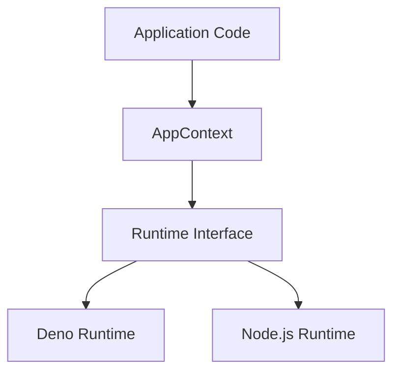

# Markdown File Synchronization Rules

## Naming Convention

- `*.md` - English version (default)
- `*.ja.md` - Japanese version
- `*.zh.md` - Simplified Chinese version

A translated document always forms a **triplet**: `example.md`, `example.ja.md`,
and `example.zh.md`. A file with no `.ja.md`/`.zh.md` sibling (e.g. `AGENTS.md`)
is simply untranslated and outside these rules; once any translation exists, all
three must exist.

## Cross-Language Links

Each markdown file must link to its two counterparts at the top, in a single
line listing the other languages separated by ` | `:

- **English version** (`*.md`): `> 🇯🇵 [日本語版](./filename.ja.md) | 🇨🇳 [简体中文](./filename.zh.md)`
- **Japanese version** (`*.ja.md`): `> 🇺🇸 [English](./filename.md) | 🇨🇳 [简体中文](./filename.zh.md)`
- **Chinese version** (`*.zh.md`): `> 🇺🇸 [English](./filename.md) | 🇯🇵 [日本語版](./filename.ja.md)`

The link line must appear within the first 5 lines of the file. Some documents
use an equivalent variant of this line (a `> [!NOTE]` callout, GitHub `:jp:` /
`:us:` / `:cn:` emoji shortcodes, or a bare link line without the blockquote);
keep the existing style of the file you are editing and just add the missing
language to it. Whatever the styling, all links to the other two languages must
be present.

## Synchronization Requirements

When creating or modifying markdown files, ensure all three language versions
are kept in sync:

1. **Creating a new file**: If you create `example.md`, also create
   `example.ja.md` and `example.zh.md` with the corresponding translations
2. **Modifying content**: When updating any one version, update the other two to
   reflect the same changes
3. **Structural consistency**: All three versions must have the same structure
   (headings, sections, lists)
4. **Cross-language links**: Every version must link to the other two at the top
5. **Deleting a file**: Delete all three versions

`pnpm run check:i18n` (`just check-i18n`) enforces requirements 1, 4 and 5
mechanically; it is wired into `check:all` and CI.

## Diagrams

When creating diagrams, prefer **Mermaid** over ASCII art / box-drawing characters:

1. **Prefer Mermaid**: Use Mermaid syntax for flowcharts, sequence diagrams, class diagrams, etc.
   - Renders consistently across platforms
   - No alignment issues with different character widths
   - Easier to maintain and modify

2. **When to use ASCII art**: Only use box-drawing characters when Mermaid cannot express the diagram (e.g., file tree structures)
   - Keep text labels in English to maintain alignment
   - Add a separate explanation table below for translations

**Mermaid example:**

## Translation Guidelines

- Translate content naturally, not word-for-word
- Keep code blocks, file paths, and technical terms unchanged
- Dates: English uses `YYYY-MM-DD`, Japanese uses `YYYY年M月D日`, Simplified
  Chinese uses `YYYY年M月D日`
- Chinese translations use **Simplified Chinese (zh-CN)** and mainland
  conventions; do not mix in Japanese kanji forms or Traditional Chinese
- **Diagrams**: Keep Mermaid diagrams identical in all versions (node labels can be translated if needed). For ASCII art diagrams, keep text in English and provide translations in a separate table below

## Exceptions

The following files are excluded from this rule:

- Files in `node_modules/`
- Auto-generated files
- Configuration files (e.g., `.claude/` directory)
