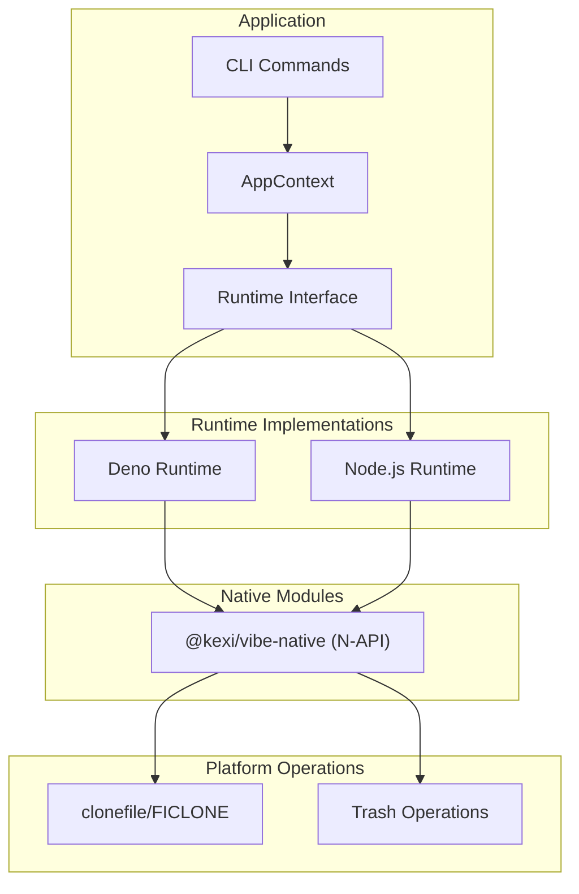
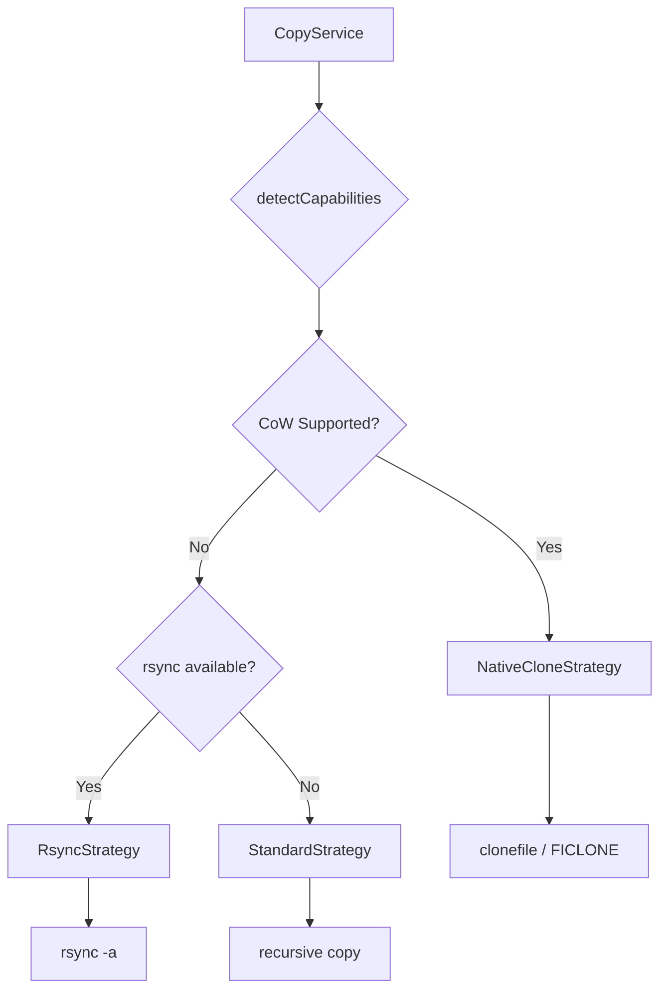
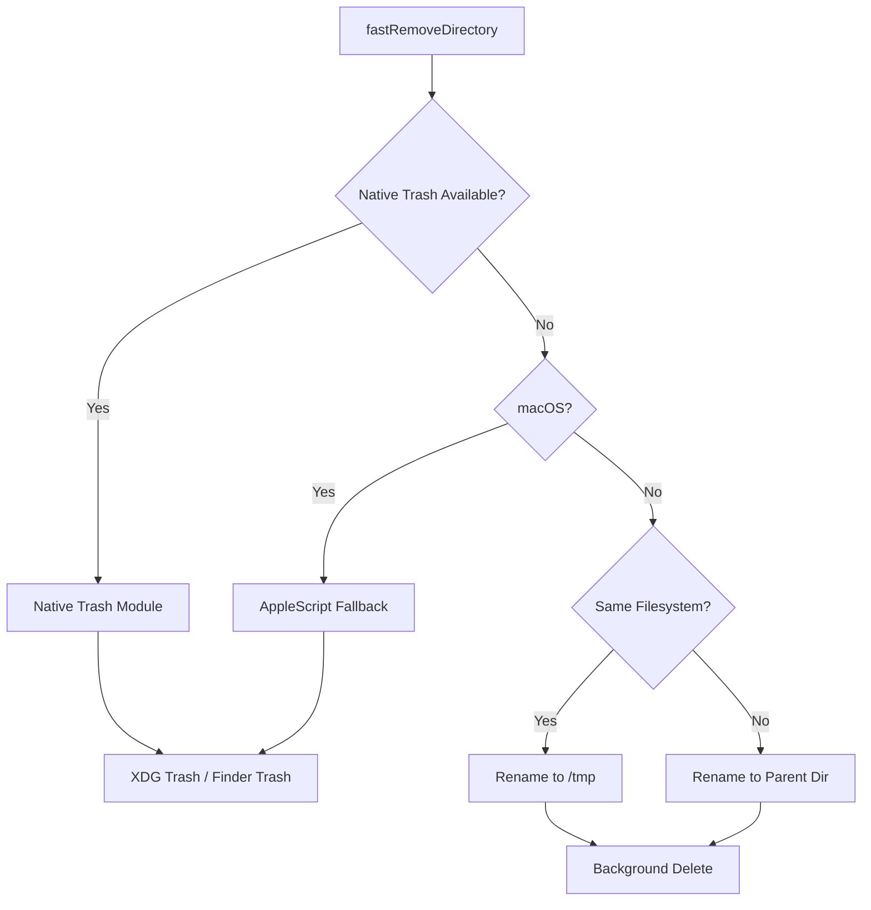
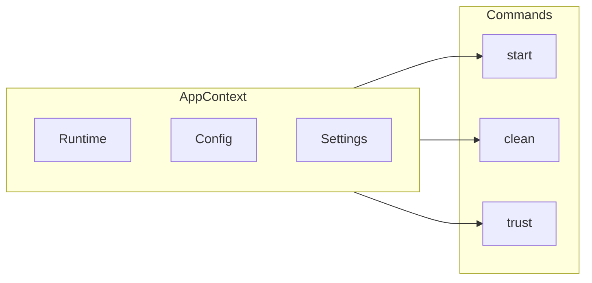
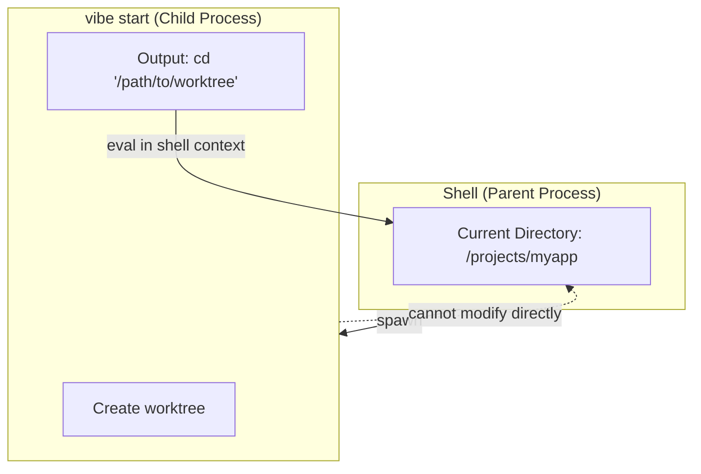

> 🇺🇸 [English](./architecture.md)

# アーキテクチャ概要

このドキュメントでは、Vibe CLI ツールのアーキテクチャについて説明します。

## ランタイム抽象化レイヤー

Vibe はランタイム抽象化レイヤーを通じて、複数の JavaScript ランタイム（Deno と Node.js）をサポートしています。



### 主要コンポーネント

| コンポーネント | 説明 |
|----------------|------|
| CLI Commands | ユーザー向けコマンド（start、clean、trust など） |
| AppContext | ランタイム、設定、ユーザー設定の依存性注入コンテナ |
| Runtime Interface | ファイルシステム、プロセス、環境操作の抽象インターフェース |
| Deno Runtime | N-API ネイティブモジュールをサポートした Deno API の実装 |
| Node.js Runtime | N-API ネイティブモジュールをサポートした Node.js API の実装 |
| @kexi/vibe-native | Copy-on-Write とゴミ箱操作用の共有 N-API モジュール |

## コピー戦略

Vibe はプラットフォームの機能に応じて、ファイルやディレクトリのコピーに異なる戦略を使用します。



### 戦略選択

| 戦略 | プラットフォーム | 説明 |
|------|------------------|------|
| NativeCloneStrategy | macOS (APFS)、Linux (Btrfs, XFS) | Copy-on-Write による即時コピー |
| RsyncStrategy | Unix 系 | rsync による効率的なコピー |
| StandardStrategy | すべて | 再帰的なファイル単位コピー |

## クリーン戦略

Vibe はゴミ箱サポート付きの高速ディレクトリ削除を提供します。



### ゴミ箱処理

| 方法 | プラットフォーム | 説明 |
|------|------------------|------|
| Native Trash | Node.js（全プラットフォーム） | trash crate を使用した @kexi/vibe-native |
| AppleScript | Deno on macOS | osascript 経由の Finder フォールバック |
| /tmp + Background | Linux（デスクトップなし） | /tmp に移動後、バックグラウンドで削除 |
| Parent Dir + Background | クロスデバイス | ネットワークマウント用の同一ファイルシステムフォールバック |

## コンテキストと依存性注入

Vibe は AppContext を通じたシンプルな依存性注入パターンを使用しています。



### メリット

1. **テスト容易性**: モックコンテキストを使用してコマンドをテスト可能
2. **柔軟性**: コマンドロジックを変更せずにランタイムを切り替え可能
3. **設定アクセス**: アプリケーション全体で設定やユーザー設定にアクセス可能

## シェルラッパーアーキテクチャ

Vibe はコマンド実行後にディレクトリ変更を有効にするため、シェルラッパーパターンを使用しています。

### UNIX プロセスモデルの制約

UNIX 系オペレーティングシステムでは、子プロセスは親プロセスの環境（カレントディレクトリを含む）を変更できません。これはオペレーティングシステムの基本的なセキュリティおよびプロセス分離機能です。



### Vibe の解決策

1. `vibe start` コマンドは worktree を作成し、シェルコマンド（例: `cd '/path/to/worktree'`）を出力する
2. シェルラッパー関数がこの出力をキャプチャする
3. ラッパーが親シェルのコンテキストでその出力を評価する
4. これによりユーザーのシェルでディレクトリ変更が有効になる

### シェル関数のセットアップ

ユーザーはシェル設定ファイル（`~/.bashrc` または `~/.zshrc`）に以下の関数を追加します：

```bash
# ~/.bashrc または ~/.zshrc に追加
vibe() { eval "$(command vibe "$@")"; }
```

これにより `vibe` コマンドをラップし、適切な場合にその出力を評価するシェル関数が定義されます。

Vibe 自体の開発者は、代わりに `.vibedev` ファイルを source します：

```bash
source .vibedev
```

### 同様のパターンを使用する他のツール

親シェルの環境を変更する必要がある他のツールも同様のパターンを使用しています：

| ツール | 目的 |
|--------|------|
| nvm | Node.js バージョンマネージャー - PATH を変更 |
| rbenv | Ruby バージョンマネージャー - PATH を変更 |
| direnv | ディレクトリ固有の環境変数 |
| pyenv | Python バージョンマネージャー - PATH を変更 |