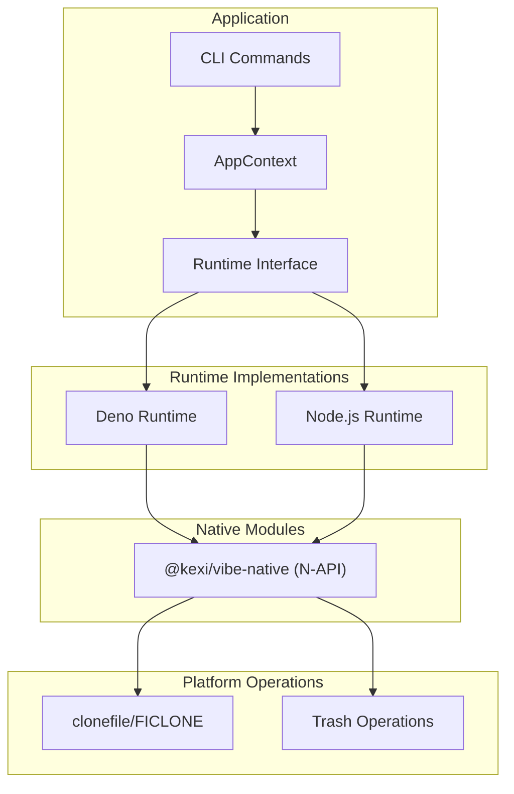
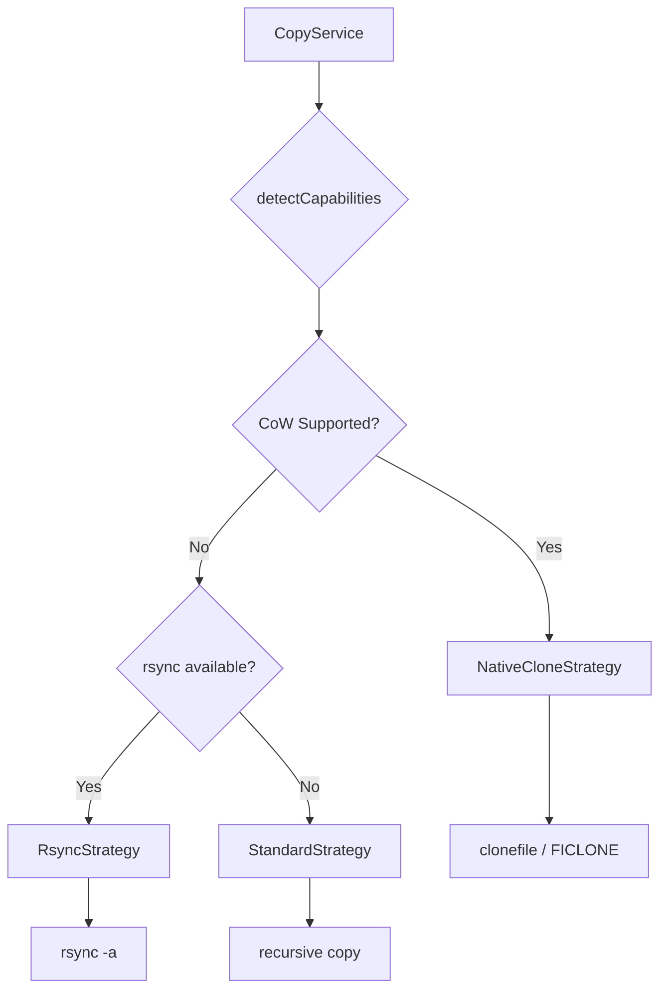
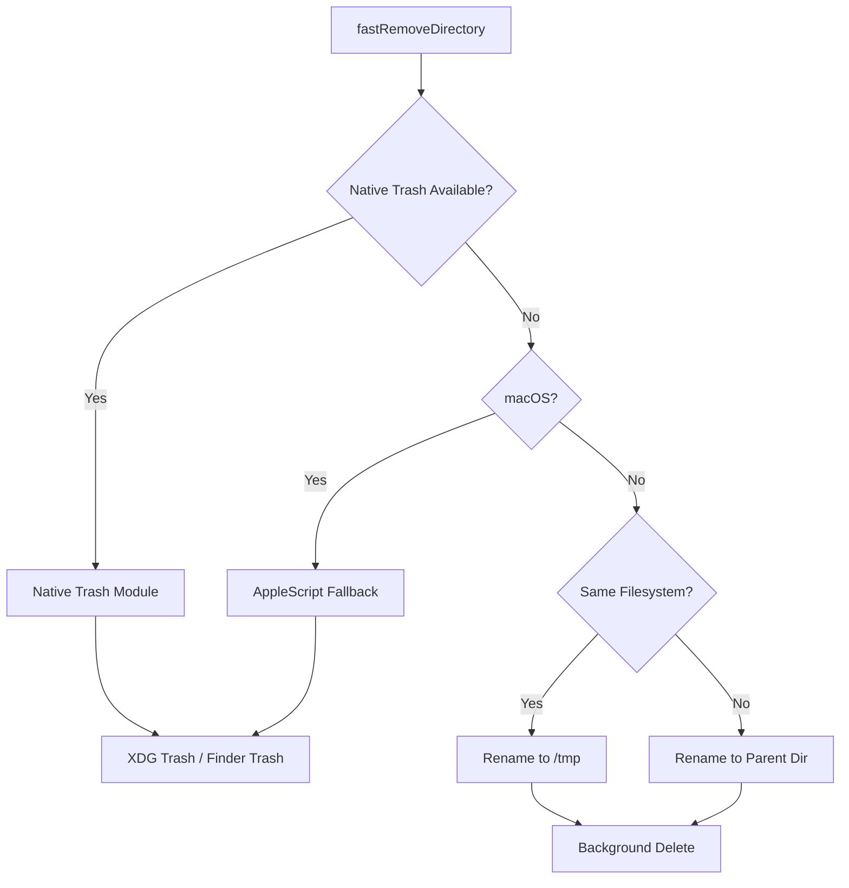
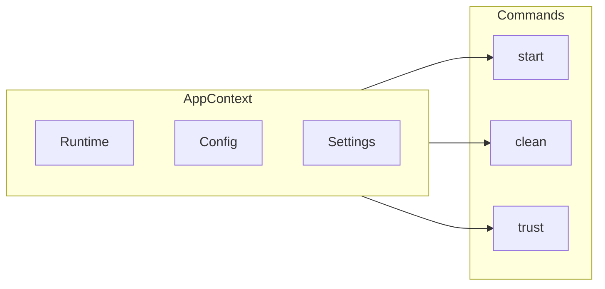

> 🇯🇵 [日本語版](./architecture.ja.md)

# Architecture Overview

This document describes the architecture of the Vibe CLI tool.

## Runtime Abstraction Layer

Vibe supports multiple JavaScript runtimes (Deno and Node.js) through a runtime abstraction layer.

### Key Components

| Component | Description |
|-----------|-------------|
| CLI Commands | User-facing commands (start, clean, trust, etc.) |
| AppContext | Dependency injection container for runtime, config, and settings |
| Runtime Interface | Abstract interface for filesystem, process, environment operations |
| Deno Runtime | Deno APIs implementation with N-API native module support |
| Node.js Runtime | Node.js APIs implementation with N-API native module support |
| @kexi/vibe-native | Shared N-API module for Copy-on-Write and trash operations |

## Copy Strategy

Vibe uses different strategies for copying files and directories based on platform capabilities.

### Strategy Selection

| Strategy | Platform | Description |
|----------|----------|-------------|
| NativeCloneStrategy | macOS (APFS), Linux (Btrfs, XFS) | Uses Copy-on-Write for instant copies |
| RsyncStrategy | Unix-like | Uses rsync for efficient copying |
| StandardStrategy | All | Recursive file-by-file copy |

## Clean Strategy

Vibe provides fast directory removal with trash support.

### Trash Handling

| Method | Platform | Description |
|--------|----------|-------------|
| Native Trash | Node.js (all platforms) | Uses @kexi/vibe-native with trash crate |
| AppleScript | Deno on macOS | Fallback using Finder via osascript |
| /tmp + Background | Linux (no desktop) | Moves to /tmp and deletes in background |
| Parent Dir + Background | Cross-device | Same filesystem fallback for network mounts |

## Context and Dependency Injection

Vibe uses a simple dependency injection pattern through AppContext.

### Benefits

1. **Testability**: Commands can be tested with mock contexts
2. **Flexibility**: Runtime can be swapped without changing command logic
3. **Configuration**: Settings and config are accessible throughout the application
