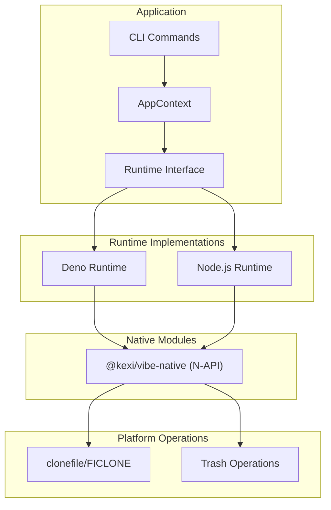
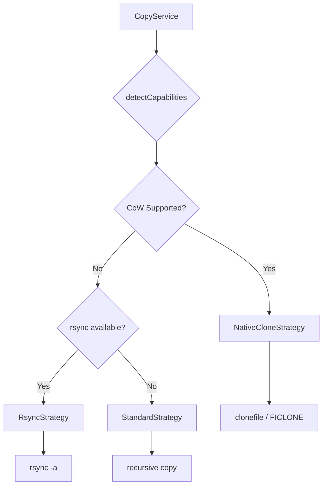
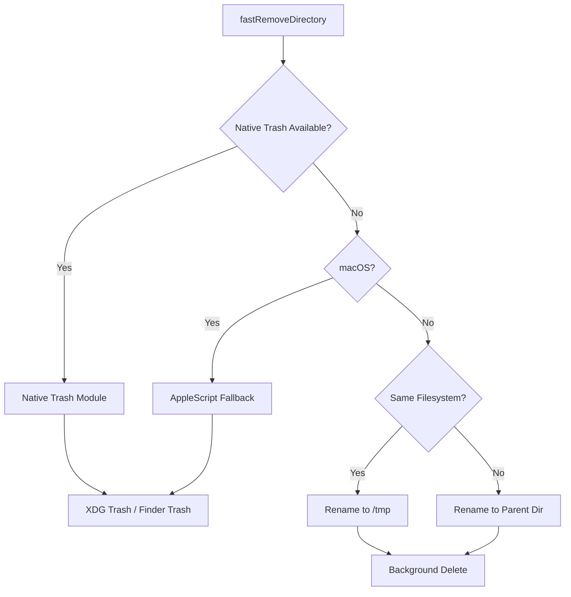
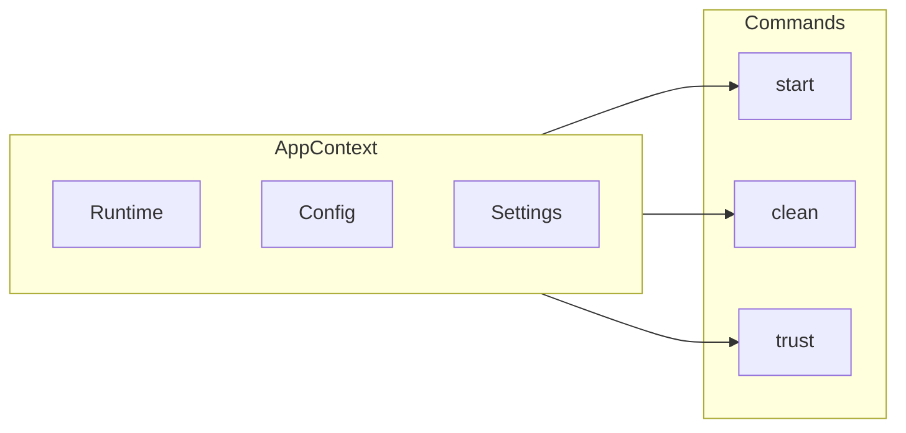
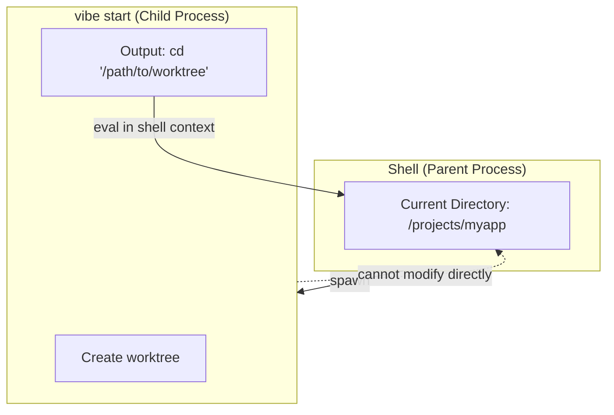

> 🇯🇵 [日本語版](./architecture.ja.md)

# Architecture Overview

This document describes the architecture of the Vibe CLI tool.

## Runtime Abstraction Layer

Vibe supports multiple JavaScript runtimes (Deno and Node.js) through a runtime abstraction layer.



### Key Components

| Component | Description |
|-----------|-------------|
| CLI Commands | User-facing commands (start, clean, trust, etc.) |
| AppContext | Dependency injection container for runtime, config, and settings |
| Runtime Interface | Abstract interface for filesystem, process, environment operations |
| Deno Runtime | Deno APIs implementation with N-API native module support |
| Node.js Runtime | Node.js APIs implementation with N-API native module support |
| @kexi/vibe-native | Shared N-API module for Copy-on-Write and trash operations |

## Copy Strategy

Vibe uses different strategies for copying files and directories based on platform capabilities.



### Strategy Selection

| Strategy | Platform | Description |
|----------|----------|-------------|
| NativeCloneStrategy | macOS (APFS), Linux (Btrfs, XFS) | Uses Copy-on-Write for instant copies |
| RsyncStrategy | Unix-like | Uses rsync for efficient copying |
| StandardStrategy | All | Recursive file-by-file copy |

## Clean Strategy

Vibe provides fast directory removal with trash support.



### Trash Handling

| Method | Platform | Description |
|--------|----------|-------------|
| Native Trash | Node.js (all platforms) | Uses @kexi/vibe-native with trash crate |
| AppleScript | Deno on macOS | Fallback using Finder via osascript |
| /tmp + Background | Linux (no desktop) | Moves to /tmp and deletes in background |
| Parent Dir + Background | Cross-device | Same filesystem fallback for network mounts |

## Context and Dependency Injection

Vibe uses a simple dependency injection pattern through AppContext.



### Benefits

1. **Testability**: Commands can be tested with mock contexts
2. **Flexibility**: Runtime can be swapped without changing command logic
3. **Configuration**: Settings and config are accessible throughout the application

## Shell Wrapper Architecture

Vibe uses a shell wrapper pattern to enable directory changes after command execution.

### UNIX Process Model Constraint

In UNIX-like operating systems, a child process cannot modify the environment (including the current working directory) of its parent process. This is a fundamental security and process isolation feature of the operating system.



### How Vibe Solves This

1. The `vibe start` command creates a worktree and outputs a shell command (e.g., `cd '/path/to/worktree'`)
2. The shell wrapper function captures this output
3. The wrapper evaluates the output in the parent shell's context
4. This allows the directory change to take effect in the user's shell

### Shell Function Setup

Users add the following function to their shell configuration file (`~/.bashrc` or `~/.zshrc`):

```bash
# Add to ~/.bashrc or ~/.zshrc
vibe() { eval "$(command vibe "$@")"; }
```

This defines a shell function that wraps the `vibe` command and evaluates its output when appropriate.

For developers working on Vibe itself, source the `.vibedev` file instead:

```bash
source .vibedev
```

### Similar Tools Using This Pattern

Other tools that need to modify the parent shell's environment use similar patterns:

| Tool | Purpose |
|------|---------|
| nvm | Node.js version manager - modifies PATH |
| rbenv | Ruby version manager - modifies PATH |
| direnv | Directory-specific environment variables |
| pyenv | Python version manager - modifies PATH |