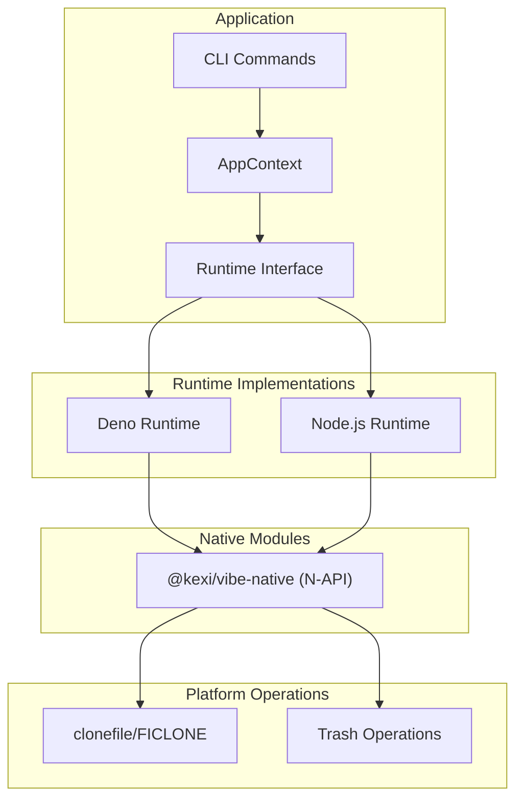
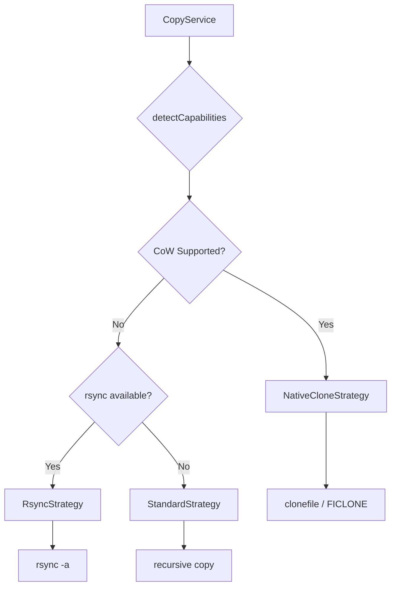
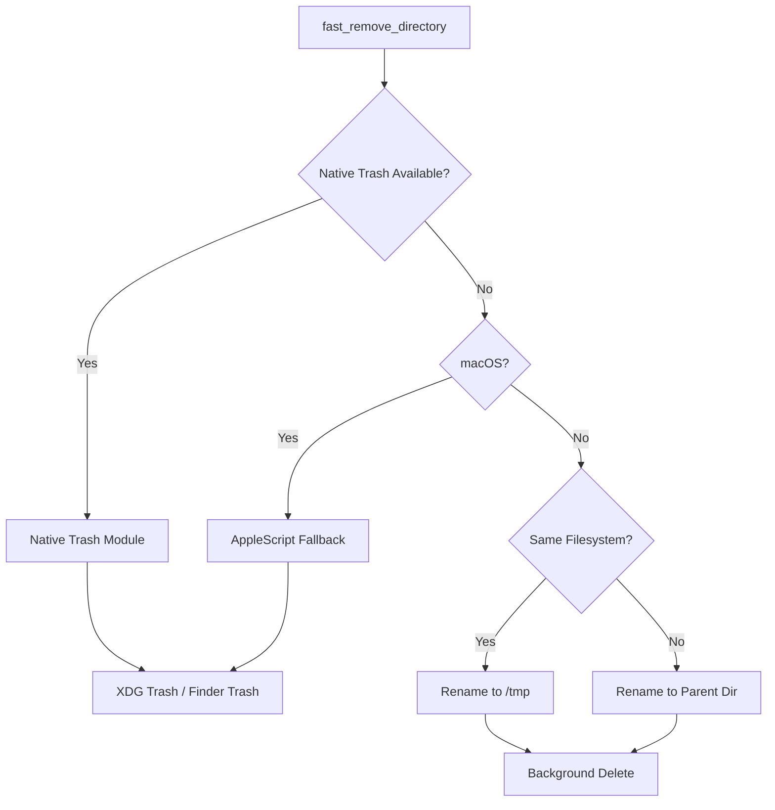
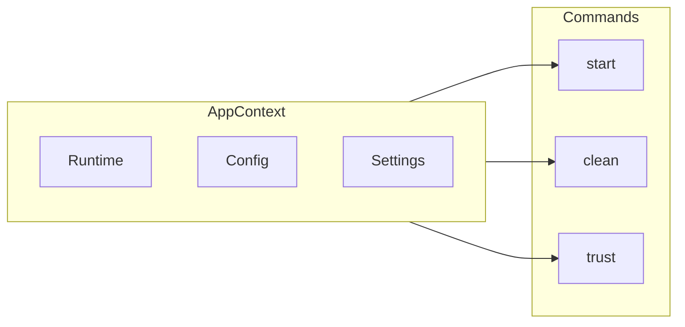
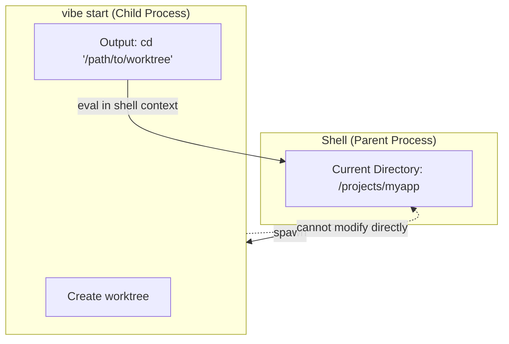

> 🇺🇸 [English](./architecture.md) | 🇯🇵 [日本語版](./architecture.ja.md)

# 架构概览

> **历史说明：** 本文所述的 TypeScript 运行时抽象层（Deno/Node.js）以及 `@kexi/vibe-native` N-API 模块，已在 Rust 移植的 Phase 6 中移除。vibe 现在是单一的 Rust 二进制文件，worktree 逻辑位于 `rust/crates/vibe-core`，原生 CoW 实现位于 `rust/crates/vibe-native`（静态链接）。本文档作为设计历史保留。

本文档介绍 Vibe CLI 工具的架构。

## 运行时抽象层

在 TypeScript 时期的实现中，Vibe 通过运行时抽象层支持多种 JavaScript 运行时（Deno 和 Node.js）。当前实现是单一的 Rust 二进制文件，不再支持 Deno。



### 核心组件

| 组件              | 说明                                             |
| ----------------- | ------------------------------------------------ |
| CLI Commands      | 面向用户的命令（start、clean、trust 等）         |
| AppContext        | 用于运行时、项目配置和用户设置的依赖注入容器     |
| Runtime Interface | 文件系统、进程、环境操作的抽象接口               |
| Deno Runtime      | 支持 N-API 原生模块的 Deno API 实现              |
| Node.js Runtime   | 支持 N-API 原生模块的 Node.js API 实现           |
| @kexi/vibe-native | 用于 Copy-on-Write 和回收站操作的共享 N-API 模块 |

## 复制策略

Vibe 会根据平台能力，为文件和目录的复制选用不同的策略。



### 策略选择

| 策略                | 平台                             | 说明                             |
| ------------------- | -------------------------------- | -------------------------------- |
| NativeCloneStrategy | macOS (APFS)、Linux (Btrfs, XFS) | 使用 Copy-on-Write 实现瞬时复制  |
| RsyncStrategy       | 类 Unix 系统                     | 使用 rsync 实现高效复制          |
| StandardStrategy    | 全部                             | 逐个文件的递归复制               |

## 清理策略

Vibe 提供支持回收站的快速目录删除能力。



### 回收站处理

| 方式                    | 平台                 | 说明                                     |
| ----------------------- | -------------------- | ---------------------------------------- |
| Native Trash            | Rust 二进制文件      | 使用 trash crate                         |
| AppleScript             | macOS 上的 Rust 二进制文件 | 通过 osascript 调用 Finder 的回退方案 |
| /tmp + Background       | Linux（无桌面环境）  | 移动到 /tmp 后在后台删除                 |
| Parent Dir + Background | 跨设备               | 面向网络挂载的同文件系统回退方案         |

## 上下文与依赖注入

Vibe 通过 AppContext 采用了简洁的依赖注入模式。



### 优势

1. **可测试性**：可以使用 mock 上下文对命令进行测试
2. **灵活性**：无需修改命令逻辑即可替换运行时
3. **配置访问**：在整个应用中都能访问项目配置和用户设置

## Shell 包装器架构

该协议的现行规范性说明请参见 [The stdout Eval Contract](specifications/eval-contract.zh.md)。

Vibe 使用 shell 包装器模式，以便在命令执行后切换目录。

### UNIX 进程模型的约束

在类 UNIX 操作系统中，子进程无法修改父进程的环境（包括当前工作目录）。这是操作系统基本的安全与进程隔离机制。



### Vibe 的解决方案

1. `vibe start` 命令创建 worktree 并输出一条 shell 命令（例如 `cd '/path/to/worktree'`）
2. shell 包装器函数捕获该输出
3. 包装器在父 shell 的上下文中对该输出求值
4. 由此，目录切换在用户的 shell 中生效

### Shell 函数的设置

用户需要在 shell 配置文件（`~/.bashrc` 或 `~/.zshrc`）中添加以下函数：

```bash
# Add to ~/.bashrc or ~/.zshrc
vibe() { eval "$(command vibe "$@")"; }
```

这样便定义了一个包装 `vibe` 命令的 shell 函数，并在合适的时候对其输出求值。

对于 Vibe 自身的开发者，可以直接从 Cargo workspace 运行该二进制文件：

```bash
cargo run --manifest-path rust/Cargo.toml -p vibe -- <command>
```

### 采用相同模式的同类工具

其他需要修改父 shell 环境的工具也采用了类似的模式：

| 工具   | 用途                            |
| ------ | ------------------------------- |
| nvm    | Node.js 版本管理器 - 修改 PATH  |
| rbenv  | Ruby 版本管理器 - 修改 PATH     |
| direnv | 目录级别的环境变量              |
| pyenv  | Python 版本管理器 - 修改 PATH   |
