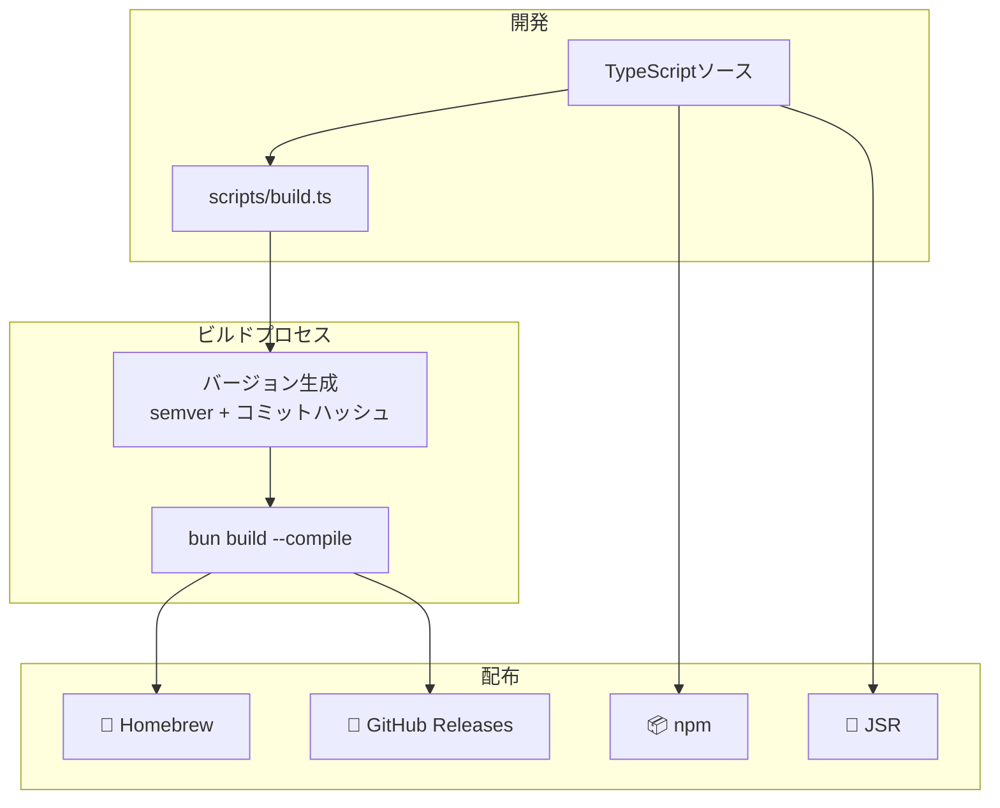
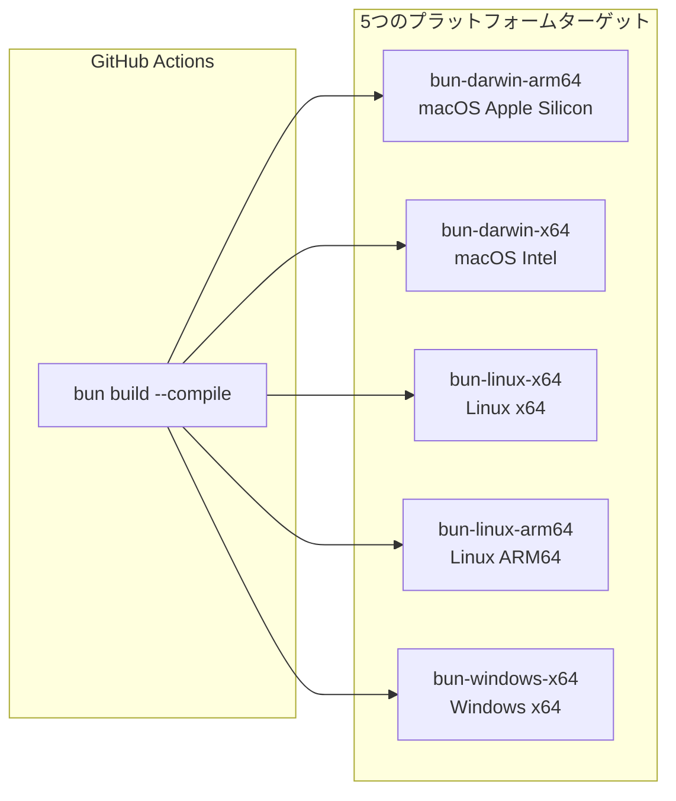

> 🇺🇸 [English](./bun-runtime.md)

# Bun ランタイム意思決定記録

このドキュメントでは、vibeのビルドランタイムとしてBunを採用した意思決定の背景、比較検討した代替案、および結果として得られたアーキテクチャについて記録します。

## なぜBunなのか？

vibeのビルドランタイムには以下の要件が求められます：

| 要件                   | 説明                                                                       |
| ---------------------- | -------------------------------------------------------------------------- |
| スタンドアロンバイナリ | ユーザーがランタイムをインストールせずに実行できる単一の実行ファイルを生成 |
| ネイティブTypeScript   | 別途コンパイルステップなしでTypeScriptを直接実行                           |
| クロスコンパイル       | 単一のマシンから複数プラットフォーム向けのバイナリをビルド                 |
| Node.js API互換性      | 馴染みのある`node:*`モジュールを使用し、コントリビューターの参入障壁を低減 |
| 高速な実行             | CLIの起動時間とコマンド実行のレイテンシを最小化                            |

### チーム・コミュニティの観点

vibeのコントリビューターの多くはNode.jsエコシステムに精通しています。Node.jsとの互換性が高いランタイムを選択することで、コントリビューションへの参入障壁を大幅に下げることができます：

- **Bun**は`node:fs/promises`、`node:child_process`、`node:path`などの標準モジュールをそのままサポート。コントリビューターは既に知っているAPIをそのまま使えます。
- **Deno**ではDeno固有のAPI（例：`Deno.readTextFile`、`Deno.Command`）を学ぶ必要があり、Node.jsの慣習とは異なります。

Node.jsの経験があれば誰でもコントリビューションしやすいという実用的な観点が、この意思決定の重要な要因となりました。

## 代替案との比較

| ソリューション | スタンドアロンバイナリ | ネイティブTS |  クロスコンパイル   | Node.js互換 | ステータス     |
| -------------- | :--------------------: | :----------: | :-----------------: | :---------: | -------------- |
| **Bun**        | `bun build --compile`  |     あり     | あり（5ターゲット） |    あり     | アクティブ     |
| Deno compile   |     `deno compile`     |     あり     |        あり         |   限定的    | アクティブ     |
| Node.js SEA    |    手動バンドリング    |     なし     |      **なし**       | ネイティブ  | 実験的         |
| pkg            |          あり          |     なし     |        あり         | ネイティブ  | アーカイブ済み |
| nexe           |          あり          |     なし     |       限定的        | ネイティブ  | 非アクティブ   |

### Deno compileを選ばなかった理由

Denoはvibeの当初のランタイムでした。しかし、Node.js APIとの互換性が限定的で、コントリビューターはDeno固有のAPIを学ぶ必要があります。これによりオンボーディングの摩擦が増し、コントリビューターの裾野が狭まります。

### Node.js SEAを選ばなかった理由

Node.js Single Executable Applications（SEA）は**クロスコンパイルに対応していません**。これが不採用の最大の理由です。vibeはCIから5つのプラットフォームターゲット向けにバイナリをビルドする必要があり、SEAでは各ターゲットプラットフォーム上でネイティブにビルドを実行しなければなりません。

### pkgやnexeを選ばなかった理由

- **pkg**: リポジトリがアーカイブされ、メンテナンスが終了しています。
- **nexe**: メンテナンス活動が最小限で、プロジェクトは事実上非アクティブです。

## Denoからの移行

vibeは元々Denoで構築され、その後ビルドランタイムをBunに移行しました。この移行の痕跡がコードベースに残っています：

```typescript
// scripts/build.ts — Deno→Bunターゲットマッピング（レガシー互換性）
const BUN_TARGETS: Record<string, string> = {
  "x86_64-unknown-linux-gnu": "bun-linux-x64",
  "aarch64-unknown-linux-gnu": "bun-linux-arm64",
  "x86_64-apple-darwin": "bun-darwin-x64",
  "aarch64-apple-darwin": "bun-darwin-arm64",
  "x86_64-pc-windows-msvc": "bun-windows-x64",
};
```

このマッピングにより、まだDenoスタイルのターゲット名を渡すCIワークフローがBunビルドパイプラインでシームレスに動作します。

### 移行で得られたメリット

- **コントリビューター体験の向上**: Deno固有のAPIではなく、標準的なNode.js APIを使用
- **ビルドツールの統一**: `deno compile`から`bun build --compile`への置き換え
- **より広いエコシステムへのアクセス**: `npm:`指定子なしでnpmパッケージを直接利用可能

## アーキテクチャ概要

### ビルド・配布フロー



### クロスコンパイルターゲット



## マルチランタイムでの位置づけ

Bunは**ビルド**ランタイムですが、vibeはランタイム抽象化レイヤーを通じてDeno、Node.js、Bunでの実行をサポートしています。特筆すべきは、BunがNode.jsランタイム実装を共有していることです。これは両ランタイムが同じ`node:*`標準モジュールをサポートしているためです：

```typescript
// packages/core/src/runtime/index.ts
function detectRuntime(): "deno" | "node" | "bun" {
  if (typeof (globalThis as any).Deno !== "undefined") {
    return "deno";
  }
  if (typeof (globalThis as any).Bun !== "undefined") {
    return "bun";
  }
  if (typeof process !== "undefined" && process.versions?.node) {
    return "node";
  }
  throw new Error("Unsupported runtime: vibe requires Deno 2.0+, Node.js 18+, or Bun 1.2+");
}
```

Bun上で実行すると`detectRuntime()`は`"bun"`を返しますが、`getRuntime()`はNode.js実装を読み込みます：

```typescript
// packages/core/src/runtime/index.ts
if (IS_DENO) {
  const { denoRuntime } = await import("./deno/index.ts");
  runtimeInstance = denoRuntime;
} else {
  // Node.jsとBunは同じ実装を使用
  const { nodeRuntime } = await import("./node/index.ts");
  runtimeInstance = nodeRuntime;
}
```

BunのNode.js API互換性が十分に包括的であるため、個別の実装は不要です。ランタイム抽象化レイヤーの詳細については、[マルチランタイムサポート](./multi-runtime.ja.md)を参照してください。

## ビルドプロセス

ビルドは`scripts/build.ts`によって管理され、バージョン生成とバイナリコンパイルを担当します。

### 使い方

```bash
bun run scripts/build.ts [options]

# オプション:
#   --target <target>        クロスコンパイルターゲット（例: bun-darwin-arm64）
#   --output <name>          出力バイナリ名（デフォルト: "vibe"）
#   --distribution <type>    配布タイプ: dev, binary, deb（デフォルト: "dev"）
#   --generate-version-only  バイナリコンパイルなしでversion.tsのみ生成
```

### バージョン生成

ビルドスクリプトは`packages/core/src/version.ts`を生成し、バージョンとビルドメタデータを含む`BUILD_INFO`オブジェクトを出力します：

```typescript
// scripts/build.tsにより自動生成
export const BUILD_INFO: BuildInfo = {
  version: "0.21.0+abc1234", // semver + コミットハッシュ
  repository: "https://github.com/kexi/vibe",
  platform: "darwin",
  arch: "arm64",
  target: "bun-darwin-arm64",
  distribution: "binary",
  buildTime: "2025-01-01T00:00:00.000Z",
  buildEnv: "github-actions", // "local" または "github-actions"
};
```

### コンパイル

実際のコンパイルは単一の`bun build --compile`呼び出しです：

```typescript
// scripts/build.ts
async function compile(options: CompileOptions): Promise<void> {
  const args = ["build", "--compile", "--minify"];
  if (options.target !== undefined) {
    args.push("--target", options.target);
  }
  args.push("--outfile", options.output);
  args.push("main.ts");
  await runCommand("bun", args, { inherit: true });
}
```

## 配布戦略

| チャネル            | 方法                      | ランタイム要件            | 備考                                       |
| ------------------- | ------------------------- | ------------------------- | ------------------------------------------ |
| **Homebrew**        | Bunコンパイル済みバイナリ | なし（スタンドアロン）    | `brew install kexi/tap/vibe`でインストール |
| **npm**             | TypeScriptソース          | Node.js 18+またはBun 1.2+ | `@kexi/vibe`として公開                     |
| **JSR**             | TypeScriptソース          | Deno 2.0+                 | `jsr:@kexi/vibe`として公開                 |
| **GitHub Releases** | スタンドアロンバイナリ    | なし（スタンドアロン）    | リリースごとに5プラットフォーム            |

## 関連ドキュメント

- [マルチランタイムサポート](./multi-runtime.ja.md) - ランタイム抽象化レイヤー
- [コピー戦略](./copy-strategies.ja.md) - CoW最適化戦略
- [アーキテクチャ](./architecture.ja.md) - システム全体のアーキテクチャ
