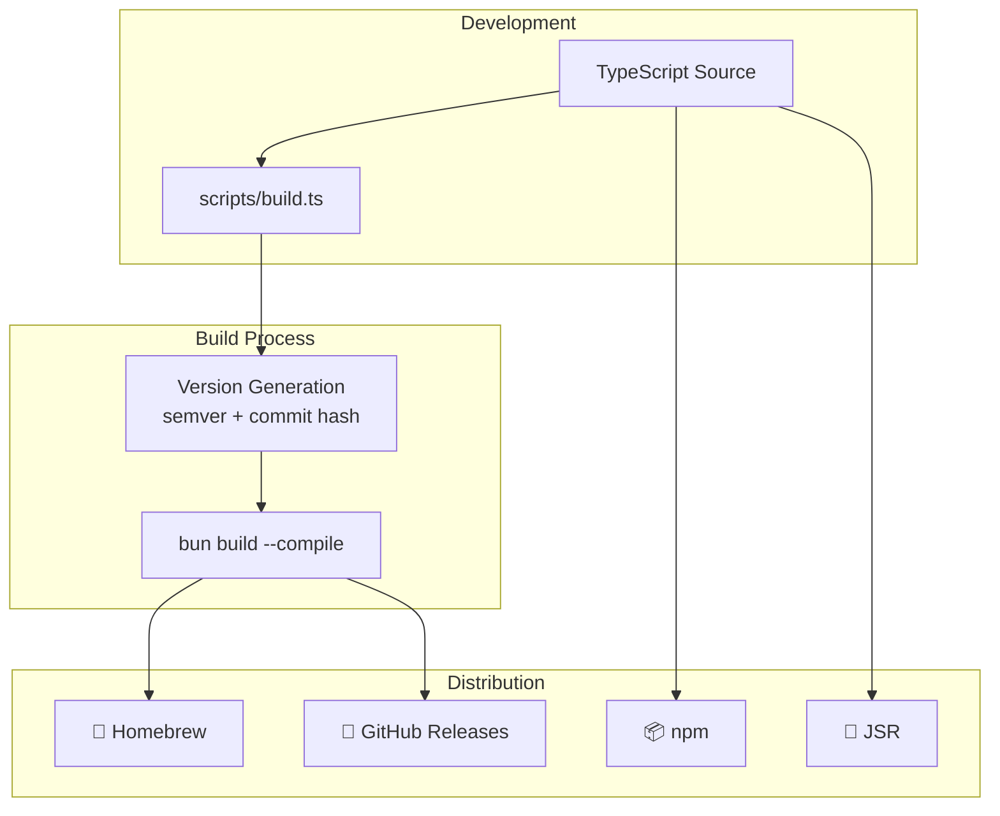
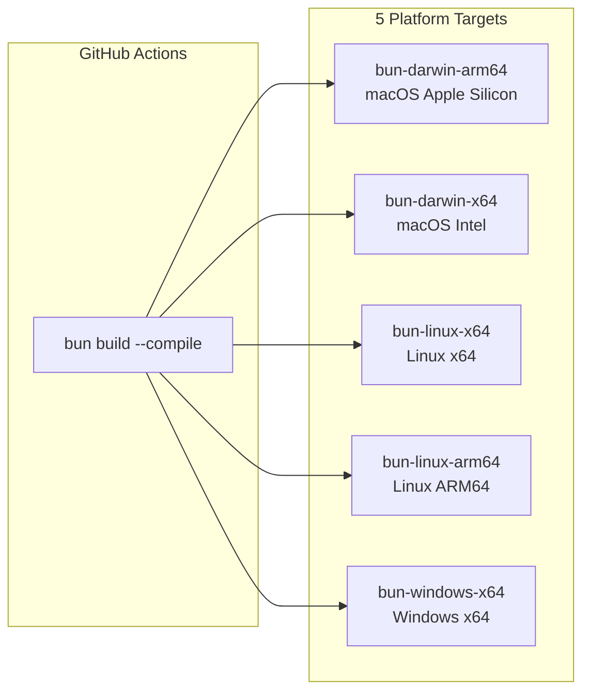

> 🇯🇵 [日本語版](./bun-runtime.ja.md)

# Bun Runtime Decision Record

This document records the decision to use Bun as vibe's build runtime, including the background, alternatives considered, and the resulting architecture.

## Why Bun?

vibe's build runtime must satisfy the following requirements:

| Requirement               | Description                                                               |
| ------------------------- | ------------------------------------------------------------------------- |
| Standalone binary         | Generate a single executable without requiring users to install a runtime |
| Native TypeScript         | Execute TypeScript directly without a separate compilation step           |
| Cross-compilation         | Build binaries for multiple platforms from a single machine               |
| Node.js API compatibility | Use familiar `node:*` modules to lower the barrier for contributors       |
| Fast execution            | Minimize CLI startup time and command execution latency                   |

### Team and Community Perspective

Most vibe contributors are experienced with the Node.js ecosystem. Choosing a runtime with high Node.js compatibility significantly lowers the barrier to contribution:

- **Bun** supports `node:fs/promises`, `node:child_process`, `node:path`, and other standard modules directly. Contributors can use the APIs they already know.
- **Deno** requires learning Deno-specific APIs (e.g., `Deno.readTextFile`, `Deno.Command`) that differ from Node.js conventions.

This practical consideration—making it easy for anyone familiar with Node.js to contribute—was a key factor in the decision.

## Comparison with Alternatives

| Solution     |   Standalone Binary   | Native TS |  Cross-Compile  | Node.js Compat | Status       |
| ------------ | :-------------------: | :-------: | :-------------: | :------------: | ------------ |
| **Bun**      | `bun build --compile` |    Yes    | Yes (5 targets) |      Yes       | Active       |
| Deno compile |    `deno compile`     |    Yes    |       Yes       |    Limited     | Active       |
| Node.js SEA  |    Manual bundling    |    No     |     **No**      |     Native     | Experimental |
| pkg          |          Yes          |    No     |       Yes       |     Native     | Archived     |
| nexe         |          Yes          |    No     |     Limited     |     Native     | Inactive     |

### Why Not Deno compile?

Deno was vibe's original runtime. However, its Node.js API compatibility is limited, and contributors must learn Deno-specific APIs. This increases onboarding friction and reduces the contributor pool.

### Why Not Node.js SEA?

Node.js Single Executable Applications (SEA) **do not support cross-compilation**. This is the primary reason for rejection. vibe must build binaries for 5 platform targets from CI, and SEA requires running the build on each target platform natively.

### Why Not pkg or nexe?

- **pkg**: The repository has been archived and is no longer maintained.
- **nexe**: Maintenance activity is minimal and the project appears inactive.

## Migration from Deno

vibe was originally built on Deno and later migrated to Bun for the build runtime. Traces of this migration remain in the codebase:

```typescript
// scripts/build.ts — Deno-to-Bun target mapping (legacy compatibility)
const BUN_TARGETS: Record<string, string> = {
  "x86_64-unknown-linux-gnu": "bun-linux-x64",
  "aarch64-unknown-linux-gnu": "bun-linux-arm64",
  "x86_64-apple-darwin": "bun-darwin-x64",
  "aarch64-apple-darwin": "bun-darwin-arm64",
  "x86_64-pc-windows-msvc": "bun-windows-x64",
};
```

This mapping allows CI workflows that still pass Deno-style target names to work seamlessly with the Bun build pipeline.

### Benefits Gained from Migration

- **Simpler contributor experience**: Standard Node.js APIs instead of Deno-specific ones
- **Unified build tooling**: `bun build --compile` replaces `deno compile`
- **Broader ecosystem access**: Direct npm package compatibility without `npm:` specifiers

## Architecture Overview

### Build and Distribution Flow



### Cross-Compilation Targets



## Multi-Runtime Architecture

Although Bun is the **build** runtime, vibe supports execution on Deno, Node.js, and Bun through a runtime abstraction layer. Notably, Bun shares the Node.js runtime implementation because both runtimes support the same `node:*` standard modules:

```typescript
// packages/core/src/runtime/index.ts
function detectRuntime(): "deno" | "node" | "bun" {
  if (typeof (globalThis as any).Deno !== "undefined") {
    return "deno";
  }
  if (typeof (globalThis as any).Bun !== "undefined") {
    return "bun";
  }
  if (typeof process !== "undefined" && process.versions?.node) {
    return "node";
  }
  throw new Error("Unsupported runtime: vibe requires Deno 2.0+, Node.js 18+, or Bun 1.2+");
}
```

When running on Bun, `detectRuntime()` returns `"bun"`, but `getRuntime()` loads the Node.js implementation:

```typescript
// packages/core/src/runtime/index.ts
if (IS_DENO) {
  const { denoRuntime } = await import("./deno/index.ts");
  runtimeInstance = denoRuntime;
} else {
  // Node.js and Bun use the same implementation
  const { nodeRuntime } = await import("./node/index.ts");
  runtimeInstance = nodeRuntime;
}
```

This works because Bun's Node.js API compatibility is comprehensive enough that a separate implementation is unnecessary. For details on the runtime abstraction layer, see [Multi-Runtime Support](./multi-runtime.md).

## Build Process

The build is orchestrated by `scripts/build.ts`, which handles version generation and binary compilation.

### Usage

```bash
bun run scripts/build.ts [options]

# Options:
#   --target <target>        Cross-compile target (e.g., bun-darwin-arm64)
#   --output <name>          Output binary name (default: "vibe")
#   --distribution <type>    Distribution type: dev, binary, deb (default: "dev")
#   --generate-version-only  Only generate version.ts without compiling
```

### Version Generation

The build script generates `packages/core/src/version.ts` with a `BUILD_INFO` object containing version and build metadata:

```typescript
// Auto-generated by scripts/build.ts
export const BUILD_INFO: BuildInfo = {
  version: "0.21.0+abc1234", // semver + commit hash
  repository: "https://github.com/kexi/vibe",
  platform: "darwin",
  arch: "arm64",
  target: "bun-darwin-arm64",
  distribution: "binary",
  buildTime: "2025-01-01T00:00:00.000Z",
  buildEnv: "github-actions", // "local" or "github-actions"
};
```

### Compilation

The actual compilation is a single `bun build --compile` invocation:

```typescript
// scripts/build.ts
async function compile(options: CompileOptions): Promise<void> {
  const args = ["build", "--compile", "--minify"];
  if (options.target !== undefined) {
    args.push("--target", options.target);
  }
  args.push("--outfile", options.output);
  args.push("main.ts");
  await runCommand("bun", args, { inherit: true });
}
```

## Distribution Strategy

| Channel             | Method              | Runtime Requirement     | Notes                                      |
| ------------------- | ------------------- | ----------------------- | ------------------------------------------ |
| **Homebrew**        | Bun-compiled binary | None (standalone)       | Installed via `brew install kexi/tap/vibe` |
| **npm**             | TypeScript source   | Node.js 18+ or Bun 1.2+ | Published as `@kexi/vibe`                  |
| **JSR**             | TypeScript source   | Deno 2.0+               | Published as `jsr:@kexi/vibe`              |
| **GitHub Releases** | Standalone binaries | None (standalone)       | 5 platform targets per release             |

## Related Documentation

- [Multi-Runtime Support](./multi-runtime.md) - Runtime abstraction layer
- [Copy Strategies](./copy-strategies.md) - CoW optimization strategies
- [Architecture](./architecture.md) - Overall system architecture
