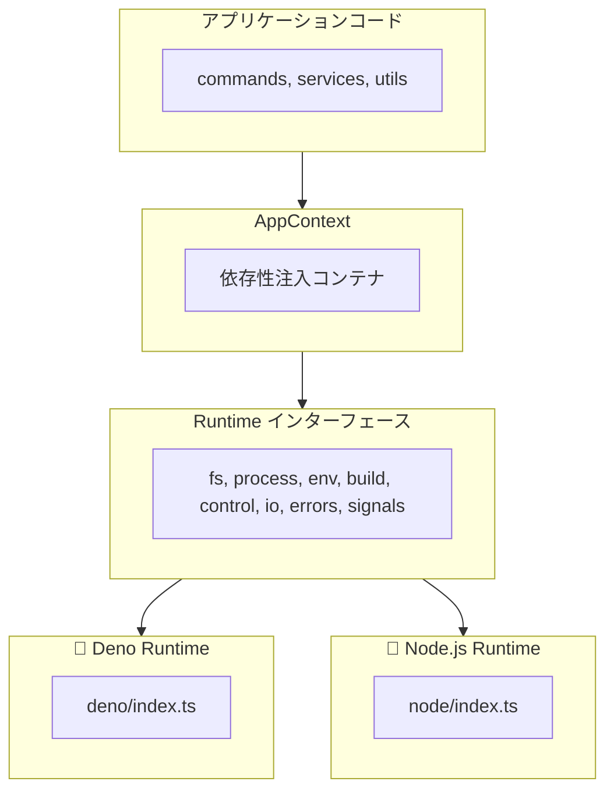

> 🇺🇸 [English](./multi-runtime.md)

# Multi-Runtime Support

vibe は、Deno、Node.js、Bun を含む複数の JavaScript/TypeScript ランタイムで CLI を実行できるランタイム抽象化レイヤーを提供します。

## ランタイム抽象化レイヤーとは？

ランタイム抽象化レイヤーは、ファイルシステムアクセス、プロセス実行、環境変数などのプラットフォーム固有の操作に対して統一されたインターフェースを提供します。これにより、同じコードベースを変更なしに異なるランタイムで実行できます。

**メリット：**

- 複数のランタイムに対応した単一コードベース
- モック実装による容易なテスト
- プラットフォーム間で一貫した API
- 依存性注入のサポート

## アーキテクチャ概要



## Runtime インターフェース

`Runtime` インターフェース（`packages/core/src/runtime/types.ts`）は、すべてのランタイム実装の契約を定義します：

| モジュール   | 説明                                 | メソッド例                             |
| ------------ | ------------------------------------ | -------------------------------------- |
| `fs`         | ファイルシステム操作                 | readFile, writeTextFile, mkdir, rename |
| `process`    | プロセス実行                         | run, spawn                             |
| `env`        | 環境変数                             | get, set, delete, toObject             |
| `build`      | プラットフォーム情報                 | os, arch                               |
| `control`    | プロセス制御                         | exit, chdir, cwd, execPath, args       |
| `io`         | 標準 I/O ストリーム                  | stdin, stderr                          |
| `errors`     | ランタイム固有のエラー型             | NotFound, AlreadyExists, isNotFound    |
| `signals`    | シグナル処理                         | addListener, removeListener            |
| `ffi`        | FFI 操作（Deno のみ、オプション）    | dlopen                                 |

## ランタイム検出

ランタイムはモジュール読み込み時に自動的に検出されます：

```typescript
// packages/core/src/runtime/index.ts より
function detectRuntime(): "deno" | "node" | "bun" {
  // Deno のチェック
  if (typeof globalThis.Deno !== "undefined") {
    return "deno";
  }

  // Bun のチェック
  if (typeof globalThis.Bun !== "undefined") {
    return "bun";
  }

  // Node.js のチェック
  if (typeof globalThis.process !== "undefined") {
    if (process.versions?.node) {
      return "node";
    }
  }

  // デフォルトは Node.js
  return "node";
}
```

## 実装詳細

### Deno Runtime

Deno の組み込み API を直接使用します：

```typescript
// packages/core/src/runtime/deno/fs.ts
export const denoFS: RuntimeFS = {
  readFile(path: string): Promise<Uint8Array> {
    return Deno.readFile(path);
  },

  readTextFile(path: string): Promise<string> {
    return Deno.readTextFile(path);
  },

  async mkdir(path: string, options?: MkdirOptions): Promise<void> {
    await Deno.mkdir(path, options);
  },
  // ...
};
```

### Node.js Runtime

Node.js API を Runtime インターフェースに合わせてラップします：

```typescript
// packages/core/src/runtime/node/fs.ts
import * as fs from "node:fs/promises";

export const nodeFS: RuntimeFS = {
  async readFile(filePath: string): Promise<Uint8Array> {
    const buffer = await fs.readFile(filePath);
    return new Uint8Array(buffer);
  },

  async readTextFile(filePath: string): Promise<string> {
    return await fs.readFile(filePath, "utf-8");
  },

  async mkdir(dirPath: string, options?: MkdirOptions): Promise<void> {
    await fs.mkdir(dirPath, {
      recursive: options?.recursive,
      mode: options?.mode,
    });
  },
  // ...
};
```

## 使用パターン

### Application Context

`AppContext` はランタイムの依存性注入を提供します：

```typescript
// packages/core/src/context/index.ts
export interface AppContext {
  readonly runtime: Runtime;
  config?: VibeConfig;
  settings?: UserSettings;
}
```

### 関数での使用

関数はオプションの `ctx` パラメータをデフォルト値付きで受け取ります：

```typescript
export async function someFunction(
  options: Options,
  ctx: AppContext = getGlobalContext(),
): Promise<void> {
  const { runtime } = ctx;

  // ファイル操作には runtime.fs を使用
  const content = await runtime.fs.readTextFile(path);

  // コマンド実行には runtime.process を使用
  const result = await runtime.process.run({
    cmd: "git",
    args: ["status"],
  });

  // 環境変数には runtime.env を使用
  const home = runtime.env.get("HOME");
}
```

### 初期化

アプリケーション起動時：

```typescript
import { initRuntime, createAppContext, setGlobalContext } from "./runtime/index.ts";
import { getGlobalContext } from "./context/index.ts";

// ランタイムを初期化
const runtime = await initRuntime();

// グローバルコンテキストを作成して設定
const ctx = createAppContext(runtime);
setGlobalContext(ctx);
```

## テストサポート

抽象化レイヤーにより、テスト用のモックが容易になります：

```typescript
// モックランタイムを作成
const mockRuntime: Runtime = {
  name: "deno",
  fs: {
    readTextFile: async () => "mock content",
    writeTextFile: async () => {},
    // ...
  },
  // ...
};

// テストコンテキストを作成
const testCtx: AppContext = { runtime: mockRuntime };

// テスト対象の関数に渡す
await someFunction(options, testCtx);
```

## ファイル構造

```
packages/core/src/runtime/
├── index.ts           # Runtime detection and initialization
├── types.ts           # Runtime interface definitions
├── deno/
│   ├── index.ts       # Deno runtime assembly
│   ├── fs.ts          # File system implementation
│   ├── process.ts     # Process execution implementation
│   ├── env.ts         # Environment and control implementation
│   ├── io.ts          # I/O streams implementation
│   ├── errors.ts      # Error types implementation
│   ├── signals.ts     # Signal handling implementation
│   └── ffi.ts         # FFI implementation (Deno-only)
└── node/
    ├── index.ts       # Node.js runtime assembly
    ├── fs.ts          # File system implementation
    ├── process.ts     # Process execution implementation
    ├── env.ts         # Environment and control implementation
    ├── io.ts          # I/O streams implementation
    ├── errors.ts      # Error types implementation
    └── signals.ts     # Signal handling implementation

packages/core/src/context/
└── index.ts           # AppContext definition and management
```

**ファイルの説明:**

| ファイル | 説明 |
| -------- | ---- |
| `runtime/index.ts` | ランタイム検出と初期化 |
| `runtime/types.ts` | Runtime インターフェース定義 |
| `deno/index.ts` | Deno ランタイム組み立て |
| `node/index.ts` | Node.js ランタイム組み立て |
| `*/fs.ts` | ファイルシステム実装 |
| `*/process.ts` | プロセス実行実装 |
| `*/env.ts` | 環境変数と制御の実装 |
| `*/io.ts` | I/O ストリーム実装 |
| `*/errors.ts` | エラー型実装 |
| `*/signals.ts` | シグナル処理実装 |
| `deno/ffi.ts` | FFI 実装（Deno のみ） |
| `context/index.ts` | AppContext 定義と管理 |

## プラットフォーム固有の機能

| 機能                   | Deno | Node.js | Bun  |
| ---------------------- | ---- | ------- | ---- |
| ファイルシステム       | Yes  | Yes     | Yes* |
| プロセス実行           | Yes  | Yes     | Yes* |
| 環境変数               | Yes  | Yes     | Yes* |
| シグナル処理           | Yes  | Yes     | Yes* |
| FFI（ネイティブ呼出し）| Yes  | No**    | No   |

\* Bun は Node.js ランタイム実装を使用
\*\* Node.js はネイティブ操作に `@kexi/vibe-native` パッケージが必要
