> 🇯🇵 [日本語版](./multi-runtime.ja.md)

# Multi-Runtime Support

vibe provides a runtime abstraction layer that enables the CLI to run on multiple JavaScript/TypeScript runtimes including Deno, Node.js, and Bun.

## What is the Runtime Abstraction Layer?

The runtime abstraction layer provides a unified interface for platform-specific operations such as file system access, process execution, and environment variables. This allows the same codebase to run on different runtimes without modification.

**Benefits:**

- Single codebase for multiple runtimes
- Easy testing with mock implementations
- Consistent API across platforms
- Dependency injection support

## Architecture Overview

```mermaid
flowchart TD
    subgraph App["Application Code"]
        AppDesc["commands, services, utils"]
    end

    subgraph Ctx["AppContext"]
        CtxDesc["Dependency Injection Container"]
    end

    subgraph Runtime["Runtime Interface"]
        RuntimeDesc["fs, process, env, build, control, io, errors, signals"]
    end

    subgraph Deno["🦕 Deno Runtime"]
        DenoDesc["deno/index.ts"]
    end

    subgraph Node["💚 Node.js Runtime"]
        NodeDesc["node/index.ts"]
    end

    App --> Ctx
    Ctx --> Runtime
    Runtime --> Deno
    Runtime --> Node
```



## Runtime Interface

The `Runtime` interface (`packages/core/src/runtime/types.ts`) defines the contract for all runtime implementations:

| Module       | Description                          | Example Methods                        |
| ------------ | ------------------------------------ | -------------------------------------- |
| `fs`         | File system operations               | readFile, writeTextFile, mkdir, rename |
| `process`    | Process execution                    | run, spawn                             |
| `env`        | Environment variables                | get, set, delete, toObject             |
| `build`      | Platform information                 | os, arch                               |
| `control`    | Process control                      | exit, chdir, cwd, execPath, args       |
| `io`         | Standard I/O streams                 | stdin, stderr                          |
| `errors`     | Runtime-specific error types         | NotFound, AlreadyExists, isNotFound    |
| `signals`    | Signal handling                      | addListener, removeListener            |
| `ffi`        | FFI operations (Deno-only, optional) | dlopen                                 |

## Runtime Detection

The runtime is automatically detected at module load time:

```typescript
// From packages/core/src/runtime/index.ts
function detectRuntime(): "deno" | "node" | "bun" {
  // Check for Deno
  if (typeof globalThis.Deno !== "undefined") {
    return "deno";
  }

  // Check for Bun
  if (typeof globalThis.Bun !== "undefined") {
    return "bun";
  }

  // Check for Node.js
  if (typeof globalThis.process !== "undefined") {
    if (process.versions?.node) {
      return "node";
    }
  }

  // Default to Node.js
  return "node";
}
```

## Implementation Details

### Deno Runtime

Uses Deno's built-in APIs directly:

```typescript
// packages/core/src/runtime/deno/fs.ts
export const denoFS: RuntimeFS = {
  readFile(path: string): Promise<Uint8Array> {
    return Deno.readFile(path);
  },

  readTextFile(path: string): Promise<string> {
    return Deno.readTextFile(path);
  },

  async mkdir(path: string, options?: MkdirOptions): Promise<void> {
    await Deno.mkdir(path, options);
  },
  // ...
};
```

### Node.js Runtime

Wraps Node.js APIs to match the Runtime interface:

```typescript
// packages/core/src/runtime/node/fs.ts
import * as fs from "node:fs/promises";

export const nodeFS: RuntimeFS = {
  async readFile(filePath: string): Promise<Uint8Array> {
    const buffer = await fs.readFile(filePath);
    return new Uint8Array(buffer);
  },

  async readTextFile(filePath: string): Promise<string> {
    return await fs.readFile(filePath, "utf-8");
  },

  async mkdir(dirPath: string, options?: MkdirOptions): Promise<void> {
    await fs.mkdir(dirPath, {
      recursive: options?.recursive,
      mode: options?.mode,
    });
  },
  // ...
};
```

## Usage Pattern

### Application Context

The `AppContext` provides dependency injection for the runtime:

```typescript
// packages/core/src/context/index.ts
export interface AppContext {
  readonly runtime: Runtime;
  config?: VibeConfig;
  settings?: UserSettings;
}
```

### Using in Functions

Functions accept an optional `ctx` parameter with a default value:

```typescript
export async function someFunction(
  options: Options,
  ctx: AppContext = getGlobalContext(),
): Promise<void> {
  const { runtime } = ctx;

  // Use runtime.fs for file operations
  const content = await runtime.fs.readTextFile(path);

  // Use runtime.process for command execution
  const result = await runtime.process.run({
    cmd: "git",
    args: ["status"],
  });

  // Use runtime.env for environment variables
  const home = runtime.env.get("HOME");
}
```

### Initialization

At application startup:

```typescript
import { initRuntime, createAppContext, setGlobalContext } from "./runtime/index.ts";
import { getGlobalContext } from "./context/index.ts";

// Initialize runtime
const runtime = await initRuntime();

// Create and set global context
const ctx = createAppContext(runtime);
setGlobalContext(ctx);
```

## Testing Support

The abstraction layer enables easy mocking for tests:

```typescript
// Create a mock runtime
const mockRuntime: Runtime = {
  name: "deno",
  fs: {
    readTextFile: async () => "mock content",
    writeTextFile: async () => {},
    // ...
  },
  // ...
};

// Create test context
const testCtx: AppContext = { runtime: mockRuntime };

// Pass to function under test
await someFunction(options, testCtx);
```

## File Structure

```
packages/core/src/runtime/
├── index.ts           # Runtime detection and initialization
├── types.ts           # Runtime interface definitions
├── deno/
│   ├── index.ts       # Deno runtime assembly
│   ├── fs.ts          # File system implementation
│   ├── process.ts     # Process execution implementation
│   ├── env.ts         # Environment and control implementation
│   ├── io.ts          # I/O streams implementation
│   ├── errors.ts      # Error types implementation
│   ├── signals.ts     # Signal handling implementation
│   └── ffi.ts         # FFI implementation (Deno-only)
└── node/
    ├── index.ts       # Node.js runtime assembly
    ├── fs.ts          # File system implementation
    ├── process.ts     # Process execution implementation
    ├── env.ts         # Environment and control implementation
    ├── io.ts          # I/O streams implementation
    ├── errors.ts      # Error types implementation
    └── signals.ts     # Signal handling implementation

packages/core/src/context/
└── index.ts           # AppContext definition and management
```

## Platform-specific Features

| Feature                | Deno | Node.js | Bun  |
| ---------------------- | ---- | ------- | ---- |
| File System            | Yes  | Yes     | Yes* |
| Process Execution      | Yes  | Yes     | Yes* |
| Environment Variables  | Yes  | Yes     | Yes* |
| Signal Handling        | Yes  | Yes     | Yes* |
| FFI (Native Calls)     | Yes  | No**    | No   |

\* Bun uses the Node.js runtime implementation
\*\* Node.js requires the `@kexi/vibe-native` package for native operations
