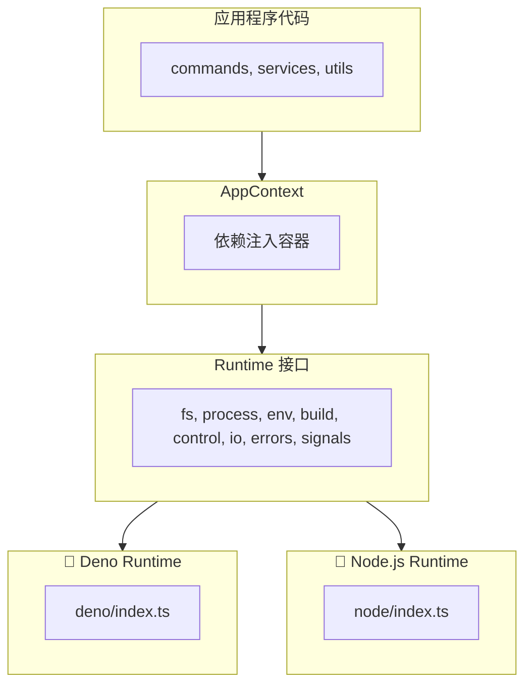

> 🇺🇸 [English](./multi-runtime.md) | 🇯🇵 [日本語版](./multi-runtime.ja.md)

# Multi-Runtime Support

> **历史性说明：** 此处描述的 TypeScript 实现已在 Rust 移植的 Phase 6 中被删除。vibe 现在是单一的 Rust 二进制文件，worktree 逻辑位于 `rust/crates/vibe-core`。本文档作为设计历史保留。

在 TypeScript 时代的实现中，vibe 提供了一个运行时抽象层，使 CLI 能够在包括 Deno、Node.js 和 Bun 在内的多个 JavaScript/TypeScript 运行时上运行。当前实现是单一的 Rust 二进制文件，不支持 Deno。

## 什么是运行时抽象层？

运行时抽象层为文件系统访问、进程执行、环境变量等平台相关操作提供统一的接口。这使得同一套代码库无需修改即可在不同运行时上运行。

**优势：**

- 面向多个运行时的单一代码库
- 借助 mock 实现轻松测试
- 跨平台一致的 API
- 支持依赖注入

## 架构概览



## Runtime 接口

`Runtime` 接口（`packages/core/src/runtime/types.ts`）定义了所有运行时实现必须遵守的契约：

| 模块      | 说明                            | 方法示例                               |
| --------- | ------------------------------- | -------------------------------------- |
| `fs`      | 文件系统操作                    | readFile, writeTextFile, mkdir, rename |
| `process` | 进程执行                        | run, spawn                             |
| `env`     | 环境变量                        | get, set, delete, toObject             |
| `build`   | 平台信息                        | os, arch                               |
| `control` | 进程控制                        | exit, chdir, cwd, execPath, args       |
| `io`      | 标准 I/O 流                     | stdin, stderr                          |
| `errors`  | 运行时特有的错误类型            | NotFound, AlreadyExists, isNotFound    |
| `signals` | 信号处理                        | addListener, removeListener            |
| `ffi`     | FFI 操作（仅 Deno，可选）       | dlopen                                 |

## 运行时检测

运行时在模块加载时被自动检测：

```typescript
// From packages/core/src/runtime/index.ts
function detectRuntime(): "deno" | "node" | "bun" {
  // Check for Deno
  if (typeof globalThis.Deno !== "undefined") {
    return "deno";
  }

  // Check for Bun
  if (typeof globalThis.Bun !== "undefined") {
    return "bun";
  }

  // Check for Node.js
  if (typeof globalThis.process !== "undefined") {
    if (process.versions?.node) {
      return "node";
    }
  }

  // Default to Node.js
  return "node";
}
```

## 实现细节

### Deno Runtime

直接使用 Deno 的内置 API：

```typescript
// packages/core/src/runtime/deno/fs.ts
export const denoFS: RuntimeFS = {
  readFile(path: string): Promise<Uint8Array> {
    return Deno.readFile(path);
  },

  readTextFile(path: string): Promise<string> {
    return Deno.readTextFile(path);
  },

  async mkdir(path: string, options?: MkdirOptions): Promise<void> {
    await Deno.mkdir(path, options);
  },
  // ...
};
```

### Node.js Runtime

将 Node.js API 包装为符合 Runtime 接口的形式：

```typescript
// packages/core/src/runtime/node/fs.ts
import * as fs from "node:fs/promises";

export const nodeFS: RuntimeFS = {
  async readFile(filePath: string): Promise<Uint8Array> {
    const buffer = await fs.readFile(filePath);
    return new Uint8Array(buffer);
  },

  async readTextFile(filePath: string): Promise<string> {
    return await fs.readFile(filePath, "utf-8");
  },

  async mkdir(dirPath: string, options?: MkdirOptions): Promise<void> {
    await fs.mkdir(dirPath, {
      recursive: options?.recursive,
      mode: options?.mode,
    });
  },
  // ...
};
```

## 使用模式

### Application Context

`AppContext` 为运行时提供依赖注入：

```typescript
// packages/core/src/context/index.ts
export interface AppContext {
  readonly runtime: Runtime;
  config?: VibeConfig;
  settings?: UserSettings;
}
```

### 在函数中使用

函数接收一个带默认值的可选 `ctx` 参数：

```typescript
export async function someFunction(
  options: Options,
  ctx: AppContext = getGlobalContext(),
): Promise<void> {
  const { runtime } = ctx;

  // Use runtime.fs for file operations
  const content = await runtime.fs.readTextFile(path);

  // Use runtime.process for command execution
  const result = await runtime.process.run({
    cmd: "git",
    args: ["status"],
  });

  // Use runtime.env for environment variables
  const home = runtime.env.get("HOME");
}
```

### 初始化

在应用程序启动时：

```typescript
import { initRuntime, createAppContext, setGlobalContext } from "./runtime/index.ts";
import { getGlobalContext } from "./context/index.ts";

// Initialize runtime
const runtime = await initRuntime();

// Create and set global context
const ctx = createAppContext(runtime);
setGlobalContext(ctx);
```

## 测试支持

抽象层使得测试中的 mock 变得容易：

```typescript
// Create a mock runtime
const mockRuntime: Runtime = {
  name: "deno",
  fs: {
    readTextFile: async () => "mock content",
    writeTextFile: async () => {},
    // ...
  },
  // ...
};

// Create test context
const testCtx: AppContext = { runtime: mockRuntime };

// Pass to function under test
await someFunction(options, testCtx);
```

## 文件结构

```
packages/core/src/runtime/
├── index.ts           # Runtime detection and initialization
├── types.ts           # Runtime interface definitions
├── deno/
│   ├── index.ts       # Deno runtime assembly
│   ├── fs.ts          # File system implementation
│   ├── process.ts     # Process execution implementation
│   ├── env.ts         # Environment and control implementation
│   ├── io.ts          # I/O streams implementation
│   ├── errors.ts      # Error types implementation
│   ├── signals.ts     # Signal handling implementation
│   └── ffi.ts         # FFI implementation (Deno-only)
└── node/
    ├── index.ts       # Node.js runtime assembly
    ├── fs.ts          # File system implementation
    ├── process.ts     # Process execution implementation
    ├── env.ts         # Environment and control implementation
    ├── io.ts          # I/O streams implementation
    ├── errors.ts      # Error types implementation
    └── signals.ts     # Signal handling implementation

packages/core/src/context/
└── index.ts           # AppContext definition and management
```

**文件说明：**

| 文件               | 说明                     |
| ------------------ | ------------------------ |
| `runtime/index.ts` | 运行时检测与初始化       |
| `runtime/types.ts` | Runtime 接口定义         |
| `deno/index.ts`    | Deno 运行时组装          |
| `node/index.ts`    | Node.js 运行时组装       |
| `*/fs.ts`          | 文件系统实现             |
| `*/process.ts`     | 进程执行实现             |
| `*/env.ts`         | 环境变量与控制的实现     |
| `*/io.ts`          | I/O 流实现               |
| `*/errors.ts`      | 错误类型实现             |
| `*/signals.ts`     | 信号处理实现             |
| `deno/ffi.ts`      | FFI 实现（仅 Deno）      |
| `context/index.ts` | AppContext 定义与管理    |

## 平台相关功能

| 功能             | Deno | Node.js | Bun   |
| ---------------- | ---- | ------- | ----- |
| 文件系统         | Yes  | Yes     | Yes\* |
| 进程执行         | Yes  | Yes     | Yes\* |
| 环境变量         | Yes  | Yes     | Yes\* |
| 信号处理         | Yes  | Yes     | Yes\* |
| FFI（原生调用）  | Yes  | No\*\*  | No    |

\* Bun 使用 Node.js 运行时实现
\*\* Node.js 的原生操作需要 `@kexi/vibe-native` 包
