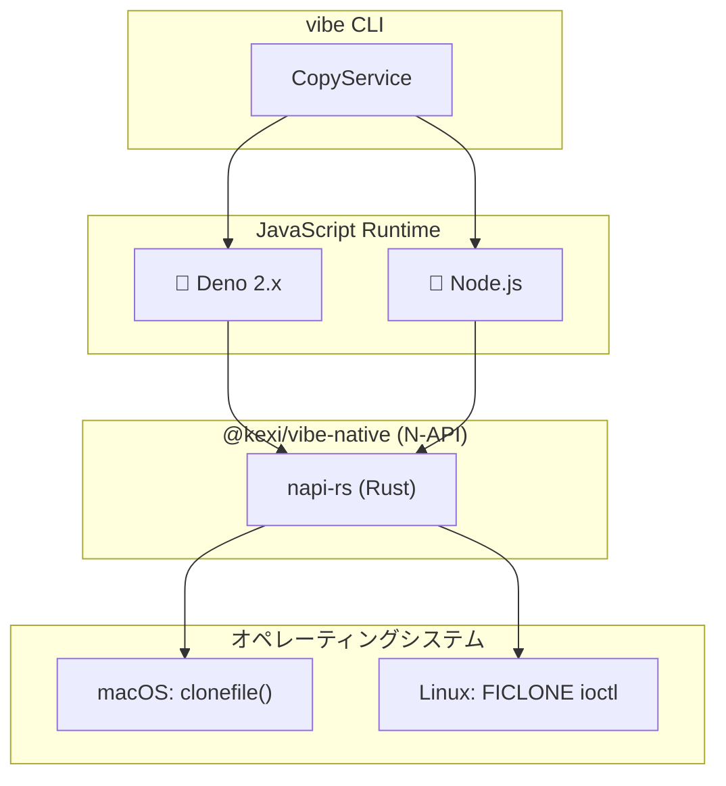

> 🇺🇸 [English](./native-clone.md)

# ネイティブクローン実装

このドキュメントでは、vibeがネイティブのCopy-on-Write（CoW）操作にRustを使用する理由と、DenoとNode.jsランタイム間での実装の違いについて説明します。

## なぜRustなのか？

vibeは`@kexi/vibe-native`パッケージで[napi-rs](https://napi.rs/)を介したRustを使用しています。これは、JavaScriptランタイムの標準APIでは利用できないOSレベルのCoW APIを呼び出すためです。

### 代替案との比較

| 言語     | メリット                                      | デメリット                                  |
| -------- | --------------------------------------------- | ------------------------------------------- |
| **Rust** | メモリ安全性、napi-rsエコシステム、強い型付け | コンパイル時間が長い                        |
| C/C++    | 直接FFI、ランタイムオーバーヘッドなし         | 手動メモリ管理、セキュリティリスク          |
| Zig      | シンプルなC連携、小さなバイナリ               | Node.jsバインディングのエコシステムが小さい |

Rustを選択した理由：

1. **メモリ安全性**: Rustの所有権モデルにより、バッファオーバーフローやuse-after-freeなどの一般的な脆弱性を防止
2. **napi-rsエコシステム**: Node.jsネイティブアドオン構築のための成熟したツール群と、TypeScript型の自動生成
3. **クロスプラットフォーム対応**: 単一のコードベースでmacOS（x64/arm64）とLinux（x64/arm64）向けにコンパイル可能

## アーキテクチャ概要

Deno 2.x以降、両ランタイムはネイティブCoW操作に同じ`@kexi/vibe-native` N-APIモジュールを使用しています。この統一により、メンテナンスが簡素化され、ランタイム間で一貫した動作が保証されます。



## 統一されたN-API実装

### なぜ両ランタイムでN-APIなのか？

Deno 2.xでN-APIモジュールのサポートが追加され（`npm:`指定子経由）、実装を統一できるようになりました：

| 観点               | 以前（Deno FFI）                | 現在（統一N-API）               |
| ------------------ | ------------------------------- | ------------------------------- |
| コード重複         | FFIコード約400行                | 単一のRust実装                  |
| メンテナンス       | 2つのコードパス                 | 1つの共有モジュール             |
| セキュリティフラグ | 個別の実装                      | 統一された`CLONE_NOFOLLOW`処理  |
| パフォーマンス     | 呼び出しごとのFFIオーバーヘッド | 最適化されたN-APIバインディング |

### Rustネイティブアドオン（N-API）

Deno 2.xとNode.jsの両方が同じRustベースのネイティブアドオンを使用しています：

```rust
// packages/native/src/lib.rs
#[napi]
pub fn clone_sync(src: String, dest: String) -> Result<()> {
    platform::clone_file(Path::new(&src), Path::new(&dest))
        .map_err(|e| e.into())
}
```

**メリット:**

- 高いパフォーマンス（呼び出しごとのFFIマーシャリングなし）
- 型安全なRust実装
- 一般的なプラットフォーム向けのプリビルドバイナリ（macOS x64/arm64、Linux x64/arm64）
- DenoとNode.js間で一貫した動作

**要件:**

- Deno 2.x または Node.js 18+
- プリビルドバイナリ、またはコンパイル用のRustツールチェーン

## プラットフォーム固有の実装

### macOS: clonefile()

| 項目                 | 詳細                                             |
| -------------------- | ------------------------------------------------ |
| システムコール       | `clonefile()`                                    |
| ファイルシステム     | APFS必須                                         |
| ファイルサポート     | あり                                             |
| ディレクトリサポート | あり                                             |
| セキュリティフラグ   | `CLONE_NOFOLLOW`（シンボリックリンク追跡を防止） |

```rust
// darwin.rs（簡略化）
extern "C" {
    fn clonefile(src: *const c_char, dst: *const c_char, flags: u32) -> c_int;
}

const CLONE_NOFOLLOW: u32 = 0x0001;

pub fn clone_file(src: &Path, dest: &Path) -> CloneResult<()> {
    validate_file_type(src)?;  // セキュリティ: シンボリックリンク、デバイスを拒否
    unsafe { clonefile(src_cstr.as_ptr(), dest_cstr.as_ptr(), CLONE_NOFOLLOW) }
}
```

### Linux: FICLONE ioctl

| 項目                 | 詳細                        |
| -------------------- | --------------------------- |
| システムコール       | `ioctl(FICLONE)`            |
| ファイルシステム     | Btrfs、XFS（reflink有効時） |
| ファイルサポート     | あり                        |
| ディレクトリサポート | なし                        |
| セキュリティフラグ   | open時に`O_NOFOLLOW`        |

```rust
// linux.rs（簡略化）
nix::ioctl_write_int!(ficlone, 0x94, 9);

pub fn clone_file(src: &Path, dest: &Path) -> CloneResult<()> {
    validate_file_type(src)?;  // セキュリティ: シンボリックリンク、デバイス、ディレクトリを拒否
    let src_file = OpenOptions::new()
        .read(true)
        .custom_flags(libc::O_NOFOLLOW)  // セキュリティ: シンボリックリンクを拒否
        .open(src)?;
    unsafe { ficlone(dest_file.as_raw_fd(), src_file.as_raw_fd() as u64) }
}
```

## セキュリティ考慮事項

Rust実装には以下のセキュリティ対策が含まれています：

### ファイルタイプ検証

通常ファイル（およびmacOSではディレクトリ）のみ許可されます。拒否されるタイプ：

| タイプ             | 理由                                         |
| ------------------ | -------------------------------------------- |
| シンボリックリンク | パストラバーサル攻撃を防止（CWE-59, CWE-61） |
| ブロックデバイス   | /dev/sda等へのアクセスを防止                 |
| キャラクタデバイス | /dev/mem等へのアクセスを防止                 |
| ソケット           | IPC悪用を防止                                |
| FIFO               | 名前付きパイプ操作を防止                     |

### レースコンディション防止

- **macOS**: `CLONE_NOFOLLOW`フラグと`__error()`経由の即時errno取得を使用
- **Linux**: ファイルを開く際に`O_NOFOLLOW`フラグを使用

### OWASP参照

- A01:2021 - アクセス制御の不備（ファイルタイプ検証）
- A04:2021 - 安全でない設計（errnoレースコンディション防止）

## ソースからのビルド

```bash
cd packages/native

# 依存関係のインストール
pnpm install

# ビルド（Rustツールチェーンが必要）
pnpm run build

# Rustテストの実行
cargo test

# リリースビルド（最適化付き）
pnpm run build:release
```

### リリースプロファイル

```toml
# Cargo.toml
[profile.release]
lto = true           # リンク時最適化
strip = "symbols"    # デバッグシンボルを削除
opt-level = "z"      # サイズ最適化
```

## 関連ドキュメント

- [コピー戦略](./copy-strategies.ja.md) - 全体的なコピー戦略の選択
- [マルチランタイムサポート](./multi-runtime.ja.md) - ランタイム抽象化レイヤー
- [@kexi/vibe-native README](../../packages/native/README.md) - パッケージAPIドキュメント
