> 🇯🇵 [日本語版](./native-clone.ja.md)

# Native Clone Implementation

This document explains why vibe uses Rust for native Copy-on-Write (CoW) operations and how the implementation differs between Deno and Node.js runtimes.

## Why Rust?

vibe uses Rust (via [napi-rs](https://napi.rs/)) for the `@kexi/vibe-native` package to call OS-level CoW APIs that are not available through JavaScript runtimes' standard APIs.

### Comparison with Alternatives

| Language | Pros | Cons |
|----------|------|------|
| **Rust** | Memory safety, napi-rs ecosystem, strong typing | Longer compile times |
| C/C++ | Direct FFI, no runtime overhead | Manual memory management, security risks |
| Zig | Simple C interop, small binaries | Smaller ecosystem for Node.js bindings |

Rust was chosen because:

1. **Memory Safety**: Rust's ownership model prevents common vulnerabilities like buffer overflows and use-after-free
2. **napi-rs Ecosystem**: Mature tooling for building Node.js native addons with automatic TypeScript type generation
3. **Cross-platform Support**: Single codebase compiles for macOS (x64/arm64) and Linux (x64/arm64)

## Architecture Overview

```mermaid
flowchart TD
    subgraph App["vibe CLI"]
        CopyService["CopyService"]
    end

    subgraph Deno["🦕 Deno Runtime"]
        DenoFFI["Deno.dlopen()"]
        DenoSyscall["Direct syscall via FFI"]
    end

    subgraph Node["💚 Node.js Runtime"]
        NativeAddon["@kexi/vibe-native"]
        NapiRs["napi-rs (Rust)"]
    end

    subgraph OS["Operating System"]
        Darwin["macOS: clonefile()"]
        Linux["Linux: FICLONE ioctl"]
    end

    CopyService --> DenoFFI
    CopyService --> NativeAddon
    DenoFFI --> DenoSyscall
    DenoSyscall --> Darwin
    DenoSyscall --> Linux
    NativeAddon --> NapiRs
    NapiRs --> Darwin
    NapiRs --> Linux
```



## Deno FFI vs Node.js N-API

### Deno: Direct FFI

Deno provides `Deno.dlopen()` for Foreign Function Interface, allowing direct calls to system libraries without native compilation:

```typescript
// packages/core/src/utils/copy/ffi/darwin.ts (simplified)
const lib = Deno.dlopen("libSystem.B.dylib", {
  clonefile: {
    parameters: ["buffer", "buffer", "u32"],
    result: "i32",
  },
});
```

**Advantages:**

- No compilation step required
- Works immediately on any Deno installation
- Source code is directly readable

**Disadvantages:**

- Requires `--allow-ffi` permission
- FFI overhead for each call

### Node.js: Rust Native Addon (N-API)

Node.js doesn't have built-in FFI, so we use Rust with napi-rs to create a native addon:

```rust
// packages/@kexi/vibe-native/src/lib.rs
#[napi]
pub fn clone_sync(src: String, dest: String) -> Result<()> {
    platform::clone_file(Path::new(&src), Path::new(&dest))
        .map_err(|e| e.into())
}
```

**Advantages:**

- Better performance (no FFI marshalling per call)
- Type-safe Rust implementation
- Prebuilt binaries for common platforms

**Disadvantages:**

- Requires compilation or prebuilt binaries
- Larger package size

## Platform-Specific Implementation

### macOS: clonefile()

| Aspect | Detail |
|--------|--------|
| System Call | `clonefile()` |
| Filesystem | APFS required |
| File Support | Yes |
| Directory Support | Yes |
| Security Flag | `CLONE_NOFOLLOW` (prevents symlink following) |

```rust
// darwin.rs (simplified)
extern "C" {
    fn clonefile(src: *const c_char, dst: *const c_char, flags: u32) -> c_int;
}

const CLONE_NOFOLLOW: u32 = 0x0001;

pub fn clone_file(src: &Path, dest: &Path) -> CloneResult<()> {
    validate_file_type(src)?;  // Security: reject symlinks, devices
    unsafe { clonefile(src_cstr.as_ptr(), dest_cstr.as_ptr(), CLONE_NOFOLLOW) }
}
```

### Linux: FICLONE ioctl

| Aspect | Detail |
|--------|--------|
| System Call | `ioctl(FICLONE)` |
| Filesystem | Btrfs, XFS (with reflink) |
| File Support | Yes |
| Directory Support | No |
| Security Flag | `O_NOFOLLOW` on open |

```rust
// linux.rs (simplified)
nix::ioctl_write_int!(ficlone, 0x94, 9);

pub fn clone_file(src: &Path, dest: &Path) -> CloneResult<()> {
    validate_file_type(src)?;  // Security: reject symlinks, devices, directories
    let src_file = OpenOptions::new()
        .read(true)
        .custom_flags(libc::O_NOFOLLOW)  // Security: reject symlinks
        .open(src)?;
    unsafe { ficlone(dest_file.as_raw_fd(), src_file.as_raw_fd() as u64) }
}
```

## Security Considerations

The Rust implementation includes several security measures:

### File Type Validation

Only regular files (and directories on macOS) are allowed. Rejected types:

| Type | Reason |
|------|--------|
| Symlinks | Prevent path traversal attacks (CWE-59, CWE-61) |
| Block devices | Prevent access to /dev/sda, etc. |
| Character devices | Prevent access to /dev/mem, etc. |
| Sockets | Prevent IPC exploitation |
| FIFOs | Prevent named pipe manipulation |

### Race Condition Prevention

- **macOS**: Uses `CLONE_NOFOLLOW` flag and immediate errno capture via `__error()`
- **Linux**: Uses `O_NOFOLLOW` flag when opening files

### OWASP References

- A01:2021 - Broken Access Control (file type validation)
- A04:2021 - Insecure Design (errno race condition prevention)

## Building from Source

```bash
cd packages/@kexi/vibe-native

# Install dependencies
pnpm install

# Build (requires Rust toolchain)
pnpm run build

# Run Rust tests
cargo test

# Build for release (with optimizations)
pnpm run build:release
```

### Release Profile

```toml
# Cargo.toml
[profile.release]
lto = true           # Link-time optimization
strip = "symbols"    # Remove debug symbols
opt-level = "z"      # Optimize for size
```

## Related Documentation

- [Copy Strategies](./copy-strategies.md) - Overall copy strategy selection
- [Multi-Runtime Support](./multi-runtime.md) - Runtime abstraction layer
- [@kexi/vibe-native README](../../packages/@kexi/vibe-native/README.md) - Package API documentation
