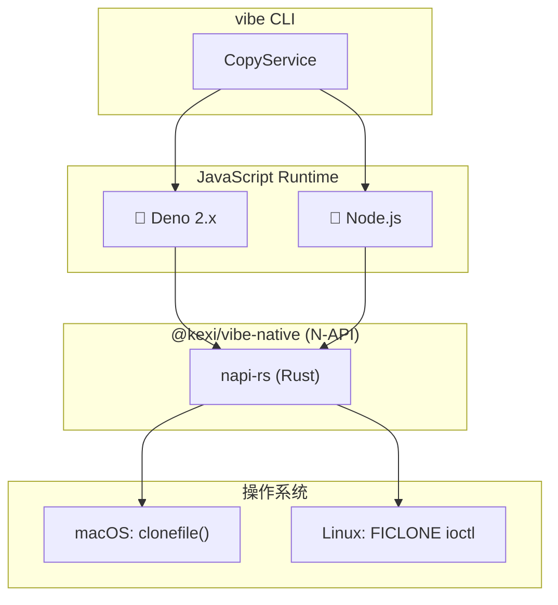

> 🇺🇸 [English](./native-clone.md) | 🇯🇵 [日本語版](./native-clone.ja.md)

# 原生克隆实现

> **历史性说明：** 此处描述的 TypeScript 运行时分支已在 Rust 移植的 Phase 6 中被删除。vibe 现在是单一的 Rust 二进制文件，原生 CoW 实现位于 `rust/crates/vibe-native`（静态链接进 `rust/crates/vibe-core`）。本文档作为设计历史保留。

这份历史文档说明了 TypeScript 时代的实现为何采用 Rust 来完成原生的 Copy-on-Write（CoW）操作，以及该实现在 Deno 与 Node.js 运行时之间有何差异。

## 为什么选择 Rust？

TypeScript 时代的实现在 `@kexi/vibe-native` 包中通过 [napi-rs](https://napi.rs/) 使用 Rust，以调用 JavaScript 运行时标准 API 无法提供的 OS 级 CoW API。

### 与替代方案的对比

| 语言     | 优点                                       | 缺点                                 |
| -------- | ------------------------------------------ | ------------------------------------ |
| **Rust** | 内存安全、napi-rs 生态系统、强类型         | 编译时间较长                         |
| C/C++    | 直接 FFI、无运行时开销                     | 手动内存管理、安全风险               |
| Zig      | 简洁的 C 互操作、二进制体积小              | 面向 Node.js 绑定的生态系统较小      |

选择 Rust 的理由：

1. **内存安全**：Rust 的所有权模型可防止缓冲区溢出、use-after-free 等常见漏洞
2. **napi-rs 生态系统**：构建 Node.js 原生插件的成熟工具链，并可自动生成 TypeScript 类型
3. **跨平台支持**：单一代码库即可为 macOS（x64/arm64）和 Linux（x64/arm64）编译

## 架构概览

在 TypeScript 时代的实现中，Deno 2.x 与 Node.js 使用同一个 `@kexi/vibe-native` N-API 模块来完成原生 CoW 操作。当前实现不再支持 Deno，而是直接使用 Rust crate。



## 统一的 N-API 实现

### 为什么两个运行时都用 N-API？

Deno 2.x 增加了对 N-API 模块的支持（通过 `npm:` 说明符），使我们得以统一实现：

| 方面       | 以前（Deno FFI）        | 当前（统一 N-API）              |
| ---------- | ----------------------- | ------------------------------- |
| 代码重复   | 约 400 行 FFI 代码      | 单一的 Rust 实现                |
| 维护成本   | 两条代码路径            | 一个共享模块                    |
| 安全标志   | 各自独立实现            | 统一的 `CLONE_NOFOLLOW` 处理    |
| 性能       | 每次调用的 FFI 开销     | 经过优化的 N-API 绑定           |

### Rust 原生插件（N-API）

Deno 2.x 与 Node.js 都使用同一个基于 Rust 的原生插件：

```rust
// packages/native/src/lib.rs
#[napi]
pub fn clone_sync(src: String, dest: String) -> Result<()> {
    platform::clone_file(Path::new(&src), Path::new(&dest))
        .map_err(|e| e.into())
}
```

**优点：**

- 更好的性能（无需每次调用进行 FFI 编组）
- 类型安全的 Rust 实现
- 面向常见平台的预构建二进制文件（macOS x64/arm64、Linux x64/arm64）
- 在 Deno 与 Node.js 之间行为一致

**当时的要求：**

- Deno 2.x 或 Node.js 18+
- 预构建二进制文件，或用于编译的 Rust 工具链

## 平台相关实现

### macOS：clonefile()

| 方面           | 详情                                     |
| -------------- | ---------------------------------------- |
| 系统调用       | `clonefile()`                            |
| 文件系统       | 需要 APFS                                |
| 文件支持       | 有                                       |
| 目录支持       | 有                                       |
| 安全标志       | `CLONE_NOFOLLOW`（防止跟随符号链接）      |

```rust
// darwin.rs (simplified)
extern "C" {
    fn clonefile(src: *const c_char, dst: *const c_char, flags: u32) -> c_int;
}

const CLONE_NOFOLLOW: u32 = 0x0001;

pub fn clone_file(src: &Path, dest: &Path) -> CloneResult<()> {
    validate_file_type(src)?;  // Security: reject symlinks, devices
    unsafe { clonefile(src_cstr.as_ptr(), dest_cstr.as_ptr(), CLONE_NOFOLLOW) }
}
```

### Linux：FICLONE ioctl

| 方面           | 详情                          |
| -------------- | ----------------------------- |
| 系统调用       | `ioctl(FICLONE)`              |
| 文件系统       | Btrfs、XFS（启用 reflink）    |
| 文件支持       | 有                            |
| 目录支持       | 无                            |
| 安全标志       | open 时使用 `O_NOFOLLOW`      |

```rust
// linux.rs (simplified)
nix::ioctl_write_int!(ficlone, 0x94, 9);

pub fn clone_file(src: &Path, dest: &Path) -> CloneResult<()> {
    validate_file_type(src)?;  // Security: reject symlinks, devices, directories
    let src_file = OpenOptions::new()
        .read(true)
        .custom_flags(libc::O_NOFOLLOW)  // Security: reject symlinks
        .open(src)?;
    unsafe { ficlone(dest_file.as_raw_fd(), src_file.as_raw_fd() as u64) }
}
```

## 安全考量

Rust 实现包含以下若干安全措施：

### 文件类型校验

仅允许常规文件（以及 macOS 上的目录）。被拒绝的类型：

| 类型         | 理由                                       |
| ------------ | ------------------------------------------ |
| 符号链接     | 防止路径遍历攻击（CWE-59, CWE-61）          |
| 块设备       | 防止访问 /dev/sda 等                        |
| 字符设备     | 防止访问 /dev/mem 等                        |
| 套接字       | 防止 IPC 被滥用                             |
| FIFO         | 防止对命名管道的操纵                        |

### 竞态条件防护

- **macOS**：使用 `CLONE_NOFOLLOW` 标志，并通过 `__error()` 立即捕获 errno
- **Linux**：打开文件时使用 `O_NOFOLLOW` 标志

### OWASP 参考

- A01:2021 - 访问控制失效（文件类型校验）
- A04:2021 - 不安全的设计（errno 竞态条件防护）

## 从源码构建

```bash
cd packages/native

# Install dependencies
pnpm install

# Build (requires Rust toolchain)
pnpm run build

# Run Rust tests
cargo test

# Build for release (with optimizations)
pnpm run build:release
```

### Release 配置

```toml
# Cargo.toml
[profile.release]
lto = true           # Link-time optimization
strip = "symbols"    # Remove debug symbols
opt-level = "z"      # Optimize for size
```

## 相关文档

- [复制策略](./copy-strategies.zh.md) - 整体的复制策略选择
- [多运行时支持](./multi-runtime.zh.md) - 运行时抽象层
- `@kexi/vibe-native` README - 包 API 文档（`packages/native` 包已在 Phase 6 中被删除，原生 CoW 实现现位于 `rust/crates/vibe-native`）
