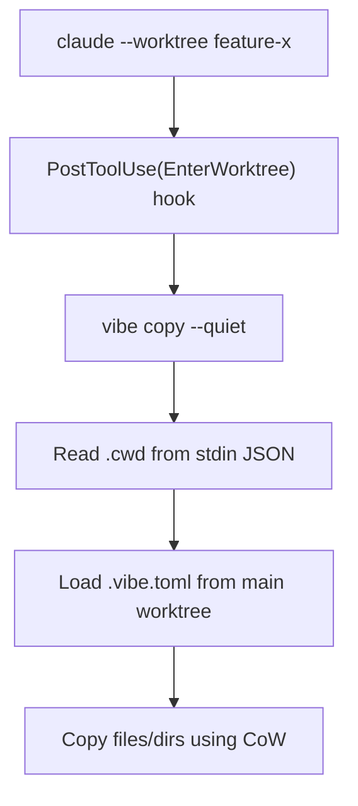

import { Badge } from "@astrojs/starlight/components";

The `copy` command copies files and directories from the main worktree to the current (or specified) worktree using Copy-on-Write (CoW) when available.

## Usage

```bash
vibe copy [options]
```

## Options

| Option            | Description                              |                           |
| ----------------- | ---------------------------------------- | ------------------------- |
| `--target <path>` | Target worktree path (explicit override) | <Badge text="v0.23.0+" /> |
| `-n`, `--dry-run` | Preview what would be copied             | <Badge text="v0.23.0+" /> |
| `-V`, `--verbose` | Show detailed output                     | <Badge text="v0.23.0+" /> |
| `-q`, `--quiet`   | Suppress non-essential output            | <Badge text="v0.23.0+" /> |

## Examples

```bash
# Copy files/dirs defined in .vibe.toml to current worktree
vibe copy

# Preview what would be copied
vibe copy --dry-run

# Copy to a specific target path
vibe copy --target /path/to/worktree

# Quiet mode (useful for hooks)
vibe copy --quiet
```

## Target Resolution

`vibe copy` determines the target worktree path using the following priority:

1. **`--target` option** - Explicit path (highest priority)
2. **stdin JSON** - Reads `{"cwd": "/path/to/worktree"}` from stdin (hook mode)
3. **Current directory** - Uses `git rev-parse --show-toplevel` (standalone mode)

## Configuration

`vibe copy` reads the `[copy]` section from `.vibe.toml` in the **main worktree**:

```toml
[copy]
files = [".env.local", "config/*.json"]
dirs = ["node_modules", ".cache"]
concurrency = 4
```

See [.vibe.toml](/configuration/vibe-toml/) for full configuration details.

## Claude Code Integration

`vibe copy` can be automatically invoked when Claude Code creates a worktree using the `--worktree` flag.

### Setup

Add the following to your project's `.claude/settings.json`:

```json
{
  "hooks": {
    "PostToolUse": [
      {
        "matcher": "EnterWorktree",
        "hooks": [
          {
            "type": "command",
            "command": "vibe copy --quiet 2>/dev/null || true",
            "timeout": 120
          }
        ]
      }
    ]
  }
}
```

### How It Works



When Claude Code's `EnterWorktree` tool fires:

1. The hook receives worktree info as JSON on stdin (including `.cwd`)
2. `vibe copy` reads stdin to determine the target path
3. Configuration is loaded from the main worktree's `.vibe.toml`
4. Files and directories are copied using CoW (Copy-on-Write) when available

The `|| true` ensures the hook doesn't fail if vibe is not installed.

## Behavior

### Main Worktree Detection

Running `vibe copy` from the main worktree exits with an error:

```
$ vibe copy
Error: Not in a worktree. 'vibe copy' must be run from a worktree.
```

### No Configuration

If no `[copy]` section exists in `.vibe.toml`, the command silently skips (exit code 0).

### Copy Failures

Individual file or directory copy failures are reported as warnings but do not stop the overall operation:

```
Warning: Failed to copy .env.local: ENOENT
```

## Difference from `vibe start`

| Feature          | `vibe start`                    | `vibe copy`            |
| ---------------- | ------------------------------- | ---------------------- |
| Creates worktree | Yes                             | No                     |
| Copies files     | Yes (as part of setup)          | Yes (standalone)       |
| Runs hooks       | Yes (`pre_start`, `post_start`) | No                     |
| Use case         | Full worktree creation          | Copy only (e.g. hooks) |
| Reads stdin      | No                              | Yes (hook mode)        |

## Related

- [start](/commands/start/) - Create worktrees with full setup
- [.vibe.toml](/configuration/vibe-toml/) - Configuration reference
- [Hooks](/configuration/hooks/) - Configure automated workflows
